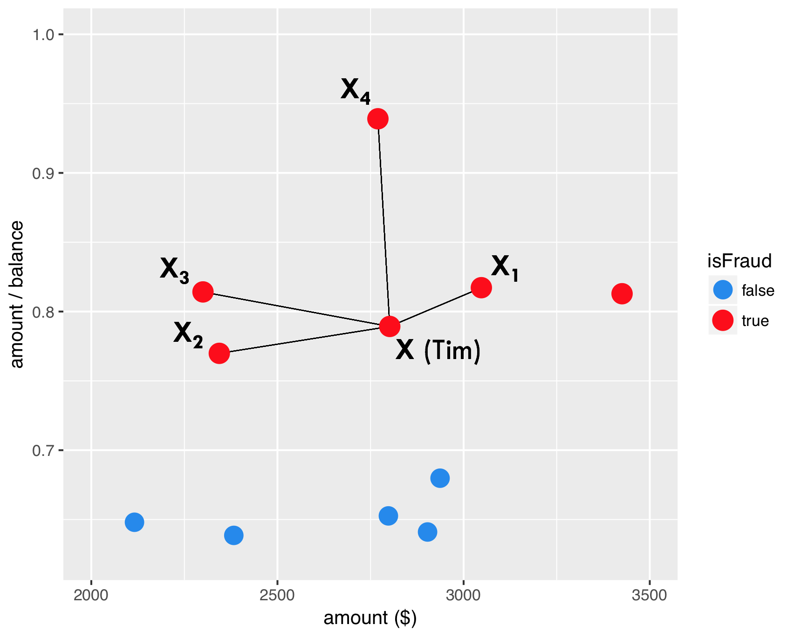
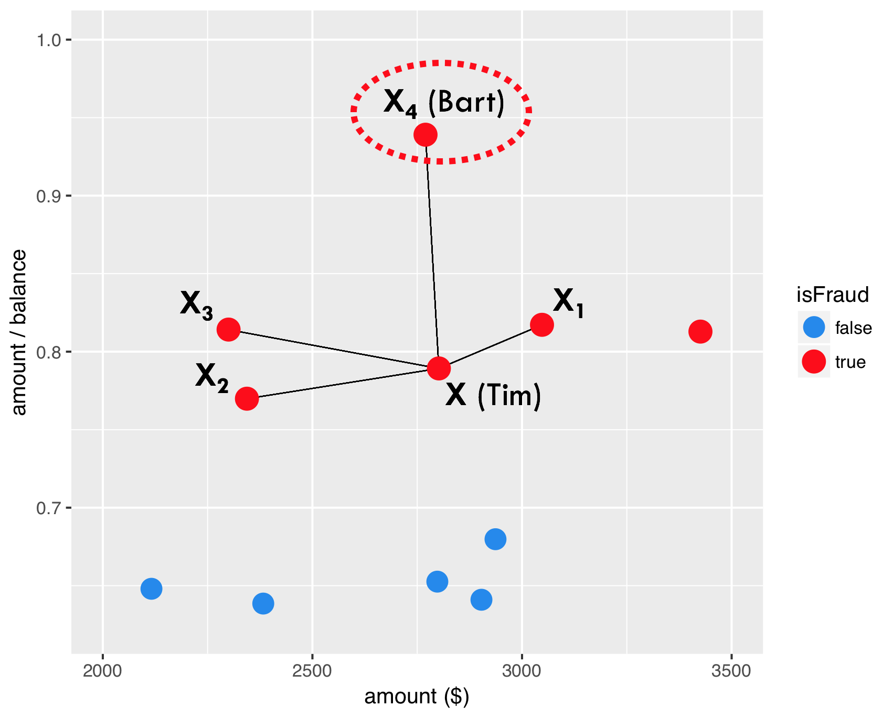
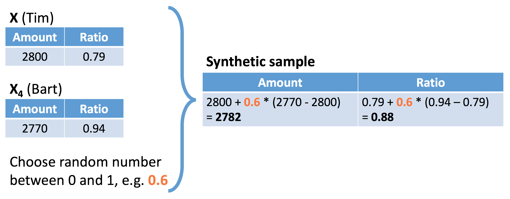
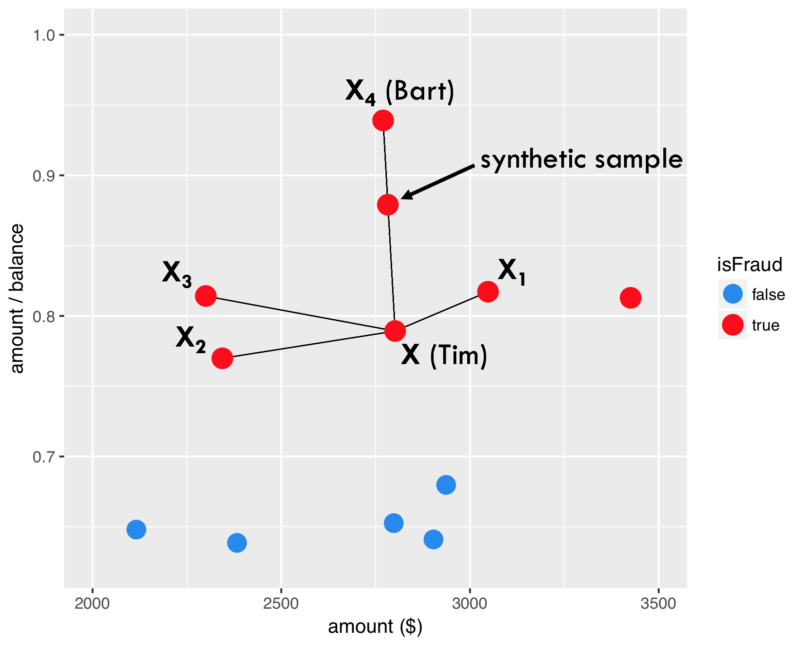

欺诈用户的样本存在严重的不平衡的问题，因此采样方法较常用。
@Chawla2002SMOTE 提出SMOTE方法，用于解决不平衡样本的问题。


## intro {#smoteintro}



如图，红色点表示欺诈用户，图中的位置反映在两特征变量上的表现。



任意选择一点。



选择任意比例，构建两点间的一个样本。



因此，SMOTE产生的新样本出现了。

>
`dup_size` parameter answers the question how many times SMOTE should loop through the existing, real fraud cases.

1. 同时参数`dup_size`给定SMOTE算法需要给每个`y=1`产生多少个新的样本。这里的`y=1`是少量样本。
1. `dup_size` 不是 $\lambda$，容易混淆。

## modeling

```{r message=FALSE, warning=FALSE}
suppressMessages(library(tidyverse))
library(smotefamily)
```

>
SMOTE can only be applied based on numeric variables since it uses the euclidean distance to determine nearest neighbors.

```{r}
creditcard <- read_rds(here::here("data/creditcard-small.rds"))
# Set the number of fraud and legitimate cases, and the desired percentage of legitimate cases
n1 <- sum(creditcard$Class==1)
n0 <- sum(creditcard$Class==0)
r0 <- 0.6
# r0: the desired percentage

# Calculate the value for the dup_size parameter of SMOTE
ntimes <- ((1 - r0) / r0) * (n0 / n1) - 1

# Create synthetic fraud cases with SMOTE
library(data.table)
smote_output <- SMOTE(X = creditcard %>% select(-Time,Class), target = creditcard$Class, K = 5, dup_size = ntimes)
# remove non-numeric vars

# Make a scatter plot of the original and over-sampled dataset
credit_smote <- smote_output$data
colnames(credit_smote)[30] <- "Class"
prop.table(table(credit_smote$Class))

ggplot(creditcard, aes(x = V1, y = V2, color = factor(Class))) +
    geom_point() +
    scale_color_manual(values = c('dodgerblue2', 'red'))

ggplot(credit_smote, aes(x = V1, y = V2, color = factor(Class))) +
  geom_point() +
  scale_color_manual(values = c('dodgerblue2', 'red'))
```

1. 你会发现，通过SMOTE算法，以后很多点连成了直线，原因这是算法的机制，具体原因见 \@ref(smoteintro)

<details>
<summary>报错`Errorin knearest(P_set, P_set, K) : 找不到对象'knD'`</summary>

1. 函数为`smotefamily::SMOTE`
1. [CSDN博客](https://blog.csdn.net/scc_hy/article/details/84190080)介绍其他的R中SMOTE的包
1. 解决办法是`install.packages("FNN")`
参考
[Stack Overflow](https://stackoverflow.com/questions/40206172/error-in-knearestdarr-p-set-k-object-knd-not-found?answertab=oldest)

</details>

1. [ ] `ntimes <- ((1 - r0) / r0) * (n0 / n1) - 1`理解公式

## split train and test

这里用于验证SMOTE方法是否有提高模型效果。

```{r}
dim(creditcard)
set.seed(123)
creditcard <- creditcard %>% mutate(Class = as.factor(Class))
train_index <- sample(nrow(creditcard),round(0.5*nrow(creditcard)))
train <- creditcard[train_index,]
test <- creditcard[-train_index,]
```

```{r}
library(rpart)
model01 <-  rpart(factor(Class) ~ ., data = train)
library(caret)
scores01 <- predict(model01,newdata=test,type = "prob")[,2]
predicted_class01 <- ifelse(scores01>0.5,1,0) %>% factor()
confusionMatrix(
    data = predicted_class01
    ,reference = test$Class
)

library(pROC)
auc(roc(response = test$Class, predictor = scores01))
```

```{r}
library(smotefamily) 
set.seed(123)
smote_result <- SMOTE(X = train %>% select(-Class),target = train$Class,K = 10, dup_size = 50)
train_oversampled <- 
    smote_result$data %>% 
    mutate(Class = class)
```

```{r}
prop.table(table(train$Class))
prop.table(table(train_oversampled$Class))
```

```{r}
library(rpart)
model02<- rpart(Class ~ ., data = train_oversampled)
```

```{r}
library(rpart)
model02 <-  rpart(factor(Class) ~ ., data = train)
library(caret)
scores02 <- predict(model02,newdata=test,type = "prob")[,2]
predicted_class02 <- ifelse(scores02>0.5,1,0) %>% factor()
confusionMatrix(
    data = predicted_class02
    ,reference = test$Class
)

library(pROC)
auc(roc(response = test$Class, predictor = scores02))
```

**SMOTE 并不是每次都有效果，因此要通过这种方法进行验证。**

## cost model

在不平衡样本中，ACC是有误导的，因此引入成本矩阵。
这是另外一种考虑。一般来说模型需要对比 KS 或者 ACC。但是业务上，损失一个预测错的 y = 1，损失会更大，因此引入成本矩阵是可以从成本角度看模型的好坏。

```{r echo=FALSE}
here::here('pic','cost_matrix.png') %>% 
    knitr::include_graphics()
```

1. [ ] SMOTE : Synthetic Minority Oversampling TEchnique (Chawla et al., 2002)


因此成本函数可以定义为

$$Cost(\text{model})=\sum_{i=1}^{N}y_i(1-\hat y_i)\text{Amount}_i + \hat y_i C_a$$


1. $y_i$为真实值，且 $\hat y_i$为预测值
1. 如图，一共有两种成本
    1. Cost of analyzing the case
    1. 被欺诈损失的本金

```{r}
cost_model <- function(predicted.classes, true.classes, amounts, fixedcost) {
  library(hmeasure)
  predicted.classes <- relabel(predicted.classes)
  true.classes <- relabel(true.classes)
  cost <- sum(true.classes * (1 - predicted.classes) * amounts + predicted.classes * fixedcost)
  return(cost)
}
```

```{r}
cost_model(
    predicted.classes = predicted_class01
    ,true.classes = test$Class
    ,amounts = test$Amount
    ,fixedcost = 10
)
cost_model(
    predicted.classes = predicted_class02
    ,true.classes = test$Class
    ,amounts = test$Amount
    ,fixedcost = 10
)
```

1. 说明SMOTE 算法无效。
1. [ ] 找一个更好的数据集，验证 SMOTE 的方法更好。
