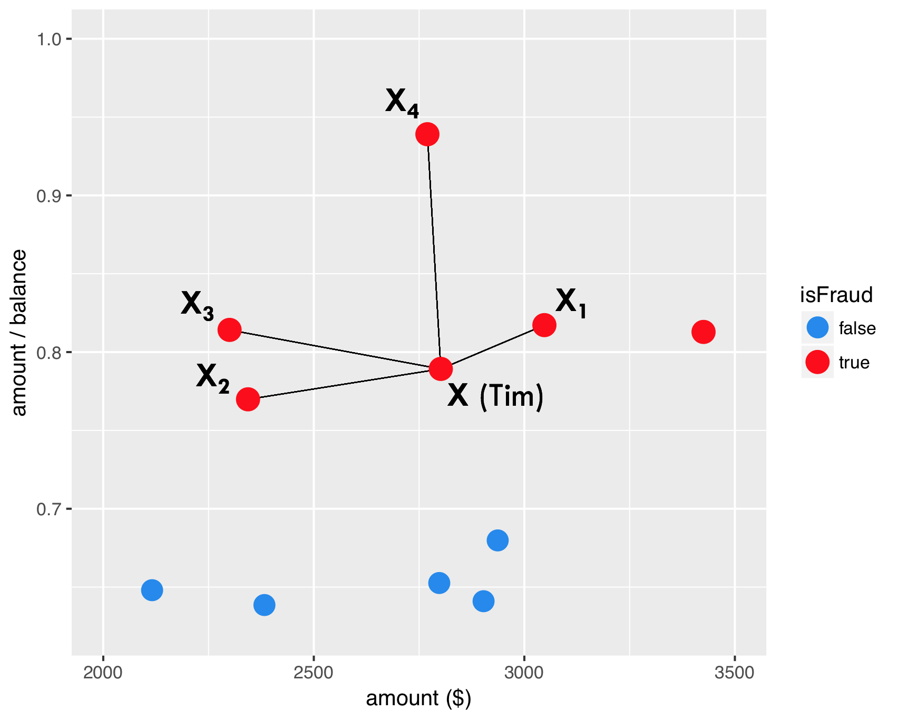
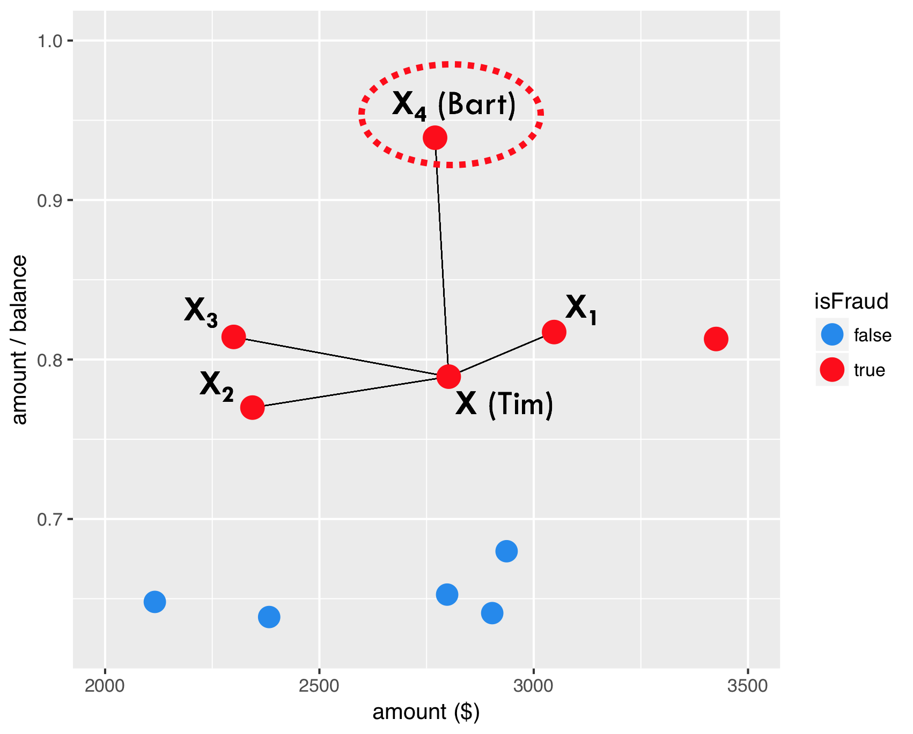

欺诈用户的样本存在严重的不平衡的问题，因此采样方法较常用。

Chawla et al. (2002) 提出SMOTE方法，用于解决不平衡样本的问题。

## intro



如图，红色点表示欺诈用户在两变量上的表现，分别连线。



任意选择一点。


选择任意比例，构建两点间的一个样本。


因此，SMOTE产生的新样本出现了。

> `dup_size` parameter answers the question how many times SMOTE should
> loop through the existing, real fraud cases.

同时参数`dup_size`给定SMOTE算法需要给每个`y=1`产生多少个新的样本。

## modeling

``` r
library(smotefamily)
```

    ## Warning: package 'smotefamily' was built under R version 3.5.3

> SMOTE can only be applied based on numeric variables since it uses the
> euclidean distance to determine nearest neighbors.

``` r
creditcard <- read_rds(here::here("data/creditcard-small.rds"))
# Set the number of fraud and legitimate cases, and the desired percentage of legitimate cases
n1 <- sum(creditcard$Class==1)
n0 <- sum(creditcard$Class==0)
r0 <- 0.6
# r0: the desired percentage

# Calculate the value for the dup_size parameter of SMOTE
ntimes <- ((1 - r0) / r0) * (n0 / n1) - 1

# Create synthetic fraud cases with SMOTE
library(data.table)
```

    ## 
    ## Attaching package: 'data.table'

    ## The following objects are masked from 'package:dplyr':
    ## 
    ##     between, first, last

    ## The following object is masked from 'package:purrr':
    ## 
    ##     transpose

``` r
smote_output <- SMOTE(X = creditcard %>% select(-Time,Class), target = creditcard$Class, K = 5, dup_size = ntimes)
# remove non-numeric vars

# Make a scatter plot of the original and over-sampled dataset
credit_smote <- smote_output$data
colnames(credit_smote)[30] <- "Class"
prop.table(table(credit_smote$Class))
```

    ## 
    ##         0         1 
    ## 0.6004735 0.3995265

``` r
ggplot(creditcard, aes(x = V1, y = V2, color = factor(Class))) +
    geom_point() +
    scale_color_manual(values = c('dodgerblue2', 'red'))
```

<!-- -->

``` r
ggplot(credit_smote, aes(x = V1, y = V2, color = factor(Class))) +
  geom_point() +
  scale_color_manual(values = c('dodgerblue2', 'red'))
```

<!-- -->

1.  你会发现，通过SMOTE算法，以后很多点连成了直线，具体见 @ref(smoteintro)

<details>

<summary>报错`Errorin knearest(P_set, P_set, K) : 找不到对象'knD'`</summary>

1.  函数为`smotefamily::SMOTE` 1
    [CSDN博客](https://blog.csdn.net/scc_hy/article/details/84190080)介绍其他的R中SMOTE的包
2.  解决办法是`install.packages("FNN")` 参考 [Stack
    Overflow](https://stackoverflow.com/questions/40206172/error-in-knearestdarr-p-set-k-object-knd-not-found?answertab=oldest)

</details>

1.  <input type="checkbox" id="checkbox1" class="styled">`ntimes <- ((1
    - r0) / r0) * (n0 / n1) - 1`理解公式

## split train and test

这里用于验证SMOTE方法是否有提高模型效果。

``` r
dim(creditcard)
```

    ## [1] 28481    31

``` r
set.seed(123)
creditcard <- creditcard %>% mutate(Class = as.factor(Class))
train_index <- sample(nrow(creditcard),round(0.5*nrow(creditcard)))
train <- creditcard[train_index,]
test <- creditcard[-train_index,]
```

``` r
library(rpart)
model01 <-  rpart(factor(Class) ~ ., data = train)
library(caret)
```

    ## Warning: package 'caret' was built under R version 3.5.3

    ## Loading required package: lattice

    ## 
    ## Attaching package: 'caret'

    ## The following object is masked from 'package:purrr':
    ## 
    ##     lift

``` r
scores01 <- predict(model01,newdata=test,type = "prob")[,2]
predicted_class01 <- ifelse(scores01>0.5,1,0) %>% factor()
confusionMatrix(
    data = predicted_class01
    ,reference = test$Class
)
```

    ## Confusion Matrix and Statistics
    ## 
    ##           Reference
    ## Prediction     0     1
    ##          0 14203     6
    ##          1     1    31
    ##                                          
    ##                Accuracy : 0.9995         
    ##                  95% CI : (0.999, 0.9998)
    ##     No Information Rate : 0.9974         
    ##     P-Value [Acc > NIR] : 1.906e-09      
    ##                                          
    ##                   Kappa : 0.8983         
    ##                                          
    ##  Mcnemar's Test P-Value : 0.1306         
    ##                                          
    ##             Sensitivity : 0.9999         
    ##             Specificity : 0.8378         
    ##          Pos Pred Value : 0.9996         
    ##          Neg Pred Value : 0.9688         
    ##              Prevalence : 0.9974         
    ##          Detection Rate : 0.9973         
    ##    Detection Prevalence : 0.9978         
    ##       Balanced Accuracy : 0.9189         
    ##                                          
    ##        'Positive' Class : 0              
    ## 

``` r
library(pROC)
```

    ## Type 'citation("pROC")' for a citation.

    ## 
    ## Attaching package: 'pROC'

    ## The following objects are masked from 'package:stats':
    ## 
    ##     cov, smooth, var

``` r
auc(roc(response = test$Class, predictor = scores01))
```

    ## Area under the curve: 0.919

``` r
library(smotefamily) 
set.seed(123)
smote_result <- SMOTE(X = train %>% select(-Class),target = train$Class,K = 10, dup_size = 50)
train_oversampled <- 
    smote_result$data %>% 
    mutate(Class = class)
```

``` r
prop.table(table(train$Class))
```

    ## 
    ##           0           1 
    ## 0.997331461 0.002668539

``` r
prop.table(table(train_oversampled$Class))
```

    ## 
    ##         0         1 
    ## 0.8799257 0.1200743

``` r
library(rpart)
model02<- rpart(Class ~ ., data = train_oversampled)
```

``` r
library(rpart)
model02 <-  rpart(factor(Class) ~ ., data = train)
library(caret)
scores02 <- predict(model02,newdata=test,type = "prob")[,2]
predicted_class02 <- ifelse(scores02>0.5,1,0) %>% factor()
confusionMatrix(
    data = predicted_class02
    ,reference = test$Class
)
```

    ## Confusion Matrix and Statistics
    ## 
    ##           Reference
    ## Prediction     0     1
    ##          0 14203     6
    ##          1     1    31
    ##                                          
    ##                Accuracy : 0.9995         
    ##                  95% CI : (0.999, 0.9998)
    ##     No Information Rate : 0.9974         
    ##     P-Value [Acc > NIR] : 1.906e-09      
    ##                                          
    ##                   Kappa : 0.8983         
    ##                                          
    ##  Mcnemar's Test P-Value : 0.1306         
    ##                                          
    ##             Sensitivity : 0.9999         
    ##             Specificity : 0.8378         
    ##          Pos Pred Value : 0.9996         
    ##          Neg Pred Value : 0.9688         
    ##              Prevalence : 0.9974         
    ##          Detection Rate : 0.9973         
    ##    Detection Prevalence : 0.9978         
    ##       Balanced Accuracy : 0.9189         
    ##                                          
    ##        'Positive' Class : 0              
    ## 

``` r
library(pROC)
auc(roc(response = test$Class, predictor = scores02))
```

    ## Area under the curve: 0.919

SMOTE 并不是每次都有效果，因此要通过这种方法进行验证。

## cost model

在不平衡样本中，ACC是有误导的，因此引入成本矩阵。

``` r
here::here('pic','cost_matrix.png') %>% 
    knitr::include_graphics()
```

<!-- -->

<input type="checkbox" id="checkbox1" class="styled">SMOTE : Synthetic
Minority Oversampling TEchnique (Chawla et al., 2002)

1.  你会发现，通过SMOTE算法，以后很多点连成了直线，具体见 @ref(smoteintro)

<details>

<summary>报错`Errorin knearest(P_set, P_set, K) : 找不到对象'knD'`</summary>

1.  函数为`smotefamily::SMOTE` 1
    [CSDN博客](https://blog.csdn.net/scc_hy/article/details/84190080)介绍其他的R中SMOTE的包
2.  解决办法是`install.packages("FNN")` 参考 [Stack
    Overflow](https://stackoverflow.com/questions/40206172/error-in-knearestdarr-p-set-k-object-knd-not-found?answertab=oldest)

</details>

1.  <input type="checkbox" id="checkbox1" class="styled">`ntimes <- ((1
    - r0) / r0) * (n0 / n1) - 1`理解公式

## split train and test

这里用于验证SMOTE方法是否有提高模型效果。

``` r
dim(creditcard)
```

    ## [1] 28481    31

``` r
set.seed(123)
creditcard <- creditcard %>% mutate(Class = as.factor(Class))
train_index <- sample(nrow(creditcard),round(0.5*nrow(creditcard)))
train <- creditcard[train_index,]
test <- creditcard[-train_index,]
```

``` r
library(rpart)
model01 <-  rpart(factor(Class) ~ ., data = train)
library(caret)
scores01 <- predict(model01,newdata=test,type = "prob")[,2]
predicted_class01 <- ifelse(scores01>0.5,1,0) %>% factor()
confusionMatrix(
    data = predicted_class01
    ,reference = test$Class
)
```

    ## Confusion Matrix and Statistics
    ## 
    ##           Reference
    ## Prediction     0     1
    ##          0 14203     6
    ##          1     1    31
    ##                                          
    ##                Accuracy : 0.9995         
    ##                  95% CI : (0.999, 0.9998)
    ##     No Information Rate : 0.9974         
    ##     P-Value [Acc > NIR] : 1.906e-09      
    ##                                          
    ##                   Kappa : 0.8983         
    ##                                          
    ##  Mcnemar's Test P-Value : 0.1306         
    ##                                          
    ##             Sensitivity : 0.9999         
    ##             Specificity : 0.8378         
    ##          Pos Pred Value : 0.9996         
    ##          Neg Pred Value : 0.9688         
    ##              Prevalence : 0.9974         
    ##          Detection Rate : 0.9973         
    ##    Detection Prevalence : 0.9978         
    ##       Balanced Accuracy : 0.9189         
    ##                                          
    ##        'Positive' Class : 0              
    ## 

``` r
library(pROC)
auc(roc(response = test$Class, predictor = scores01))
```

    ## Area under the curve: 0.919

``` r
library(smotefamily) 
set.seed(123)
smote_result <- SMOTE(X = train %>% select(-Class),target = train$Class,K = 10, dup_size = 50)
train_oversampled <- 
    smote_result$data %>% 
    mutate(Class = class)
```

``` r
prop.table(table(train$Class))
```

    ## 
    ##           0           1 
    ## 0.997331461 0.002668539

``` r
prop.table(table(train_oversampled$Class))
```

    ## 
    ##         0         1 
    ## 0.8799257 0.1200743

``` r
library(rpart)
model02<- rpart(Class ~ ., data = train_oversampled)
```

``` r
library(rpart)
model02 <-  rpart(factor(Class) ~ ., data = train)
library(caret)
scores02 <- predict(model02,newdata=test,type = "prob")[,2]
predicted_class02 <- ifelse(scores02>0.5,1,0) %>% factor()
confusionMatrix(
    data = predicted_class02
    ,reference = test$Class
)
```

    ## Confusion Matrix and Statistics
    ## 
    ##           Reference
    ## Prediction     0     1
    ##          0 14203     6
    ##          1     1    31
    ##                                          
    ##                Accuracy : 0.9995         
    ##                  95% CI : (0.999, 0.9998)
    ##     No Information Rate : 0.9974         
    ##     P-Value [Acc > NIR] : 1.906e-09      
    ##                                          
    ##                   Kappa : 0.8983         
    ##                                          
    ##  Mcnemar's Test P-Value : 0.1306         
    ##                                          
    ##             Sensitivity : 0.9999         
    ##             Specificity : 0.8378         
    ##          Pos Pred Value : 0.9996         
    ##          Neg Pred Value : 0.9688         
    ##              Prevalence : 0.9974         
    ##          Detection Rate : 0.9973         
    ##    Detection Prevalence : 0.9978         
    ##       Balanced Accuracy : 0.9189         
    ##                                          
    ##        'Positive' Class : 0              
    ## 

``` r
library(pROC)
auc(roc(response = test$Class, predictor = scores02))
```

    ## Area under the curve: 0.919

SMOTE 并不是每次都有效果，因此要通过这种方法进行验证。

## cost model

在不平衡样本中，ACC是有误导的，因此引入成本矩阵。

``` r
here::here('pic','cost_matrix.png') %>% 
    knitr::include_graphics()
```

<!-- -->

如图，一共有两种成本

<input type="checkbox" id="checkbox1" class="styled">仿照PPT出题

1.  Cost of analyzing the case
2.  被欺诈损失的本金

加入SMOTE 的结构后，模型变得更加复杂了，更好了。

因此成本函数可以定义为

`cost_model`
定义。

\[Cost(\text{model})=\sum_{i=1}^{N}y_i(1-\hat y_i)\text{Amount}_i + \hat y_i C_a\]

1.  \(y_i\)为真实值
2.  \(\hat y_i\)为预测值

ACC
是有误导的。

``` r
cost_model <- function(predicted.classes, true.classes, amounts, fixedcost) {
  library(hmeasure)
  predicted.classes <- relabel(predicted.classes)
  true.classes <- relabel(true.classes)
  cost <- sum(true.classes * (1 - predicted.classes) * amounts + predicted.classes * fixedcost)
  return(cost)
}
```

``` r
cost_model(
    predicted.classes = predicted_class01
    ,true.classes = test$Class
    ,amounts = test$Amount
    ,fixedcost = 10
)
```

    ## Warning: package 'hmeasure' was built under R version 3.5.3

    ## [1] 1356.12

``` r
cost_model(
    predicted.classes = predicted_class02
    ,true.classes = test$Class
    ,amounts = test$Amount
    ,fixedcost = 10
)
```

    ## [1] 1356.12

1.  说明SMOTE 算法无效。

<div id="refs" class="references">

<div id="ref-Chawla2002SMOTE">

Chawla, Nitesh V., Kevin W. Bowyer, Lawrence O. Hall, and W. Philip
Kegelmeyer. 2002. “SMOTE: Synthetic Minority over-Sampling Technique.”
*Journal of Artificial Intelligence Research* 16 (1): 321–57.

</div>

</div>
