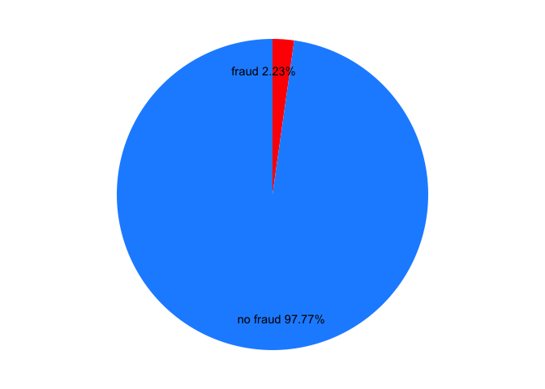
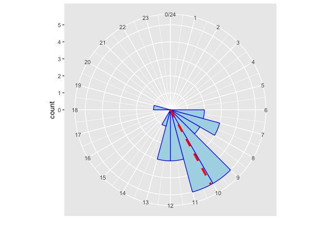

主要参考 Baesens and Höppner (2018) 的讲解。

主要内容

1.  periodic time features
2.  use networks to fight fraud <!-- 老柴 -->
3.  the imbalance or skewness of the data and
4.  the various costs for different types of misclassification
5.  digit analysis

<!-- end list -->

``` r
knitr::opts_chunk$set(warning = FALSE, message = FALSE)
```

    ## [1] 7309.576 3048.104 4479.268 7170.568 2318.984 7674.572

    ## # A tibble: 6 x 2
    ##   ORIG_BALANCE_BEFORE AMOUNT
    ## *               <dbl>  <dbl>
    ## 1                1902     25
    ## 2                1766     35
    ## 3                1252     25
    ## 4                2112     39
    ## 5                1247    277
    ## 6                 945     NA

  - read
    `.Rdata`  
    <https://stackoverflow.com/questions/7270544/how-to-see-data-from-rdata-file>

<!-- end list -->

``` r
transfers <- 
    bind_cols(
        fread(here('data','transfer01.csv'))
        ,fread(here('data','transfer02.csv'))
        ,fread(here('data','transfer03.csv'))
    )
```

``` r
theme_nothing <- 
function (base_size = 12, legend = FALSE) 
{
    if (legend) {
        return(theme(axis.text = element_blank(), axis.title = element_blank(), 
            panel.background = element_blank(), panel.grid.major = element_blank(), 
            panel.grid.minor = element_blank(), axis.ticks.length = unit(0, 
                "cm"), panel.margin = unit(0, "lines"), plot.margin = unit(c(0, 
                0, 0, 0), "lines"), complete = TRUE))
    }
    else {
        return(theme(line = element_blank(), rect = element_blank(), 
            text = element_blank(), axis.ticks.length = unit(0, 
                "cm"), legend.position = "none", panel.margin = unit(0, 
                "lines"), plot.margin = unit(c(0, 0, 0, 0), "lines"), 
            complete = TRUE))
    }
}
```

# imbalance

``` r
# Print the first 6 rows of the dataset
head(transfers)
```

    ## # A tibble: 6 x 15
    ##      id fraud_flag transfer_id timestamp orig_account_id benef_account_id
    ##   <int>      <int> <chr>           <int> <chr>           <chr>           
    ## 1   226          0 xtr215694    21966103 X27769025       X86111129       
    ## 2   141          0 xtr671675    40885557 X15452684       X63932196       
    ## 3   493          0 xtr977348    19945191 X96278924       X56011266       
    ## 4   240          0 xtr655123    27404301 X27769025       X95653232       
    ## 5   445          0 xtr785302     6566236 X96278924       X85352318       
    ## 6    88          0 xtr187306    17576922 X15452684       X18544316       
    ## # ... with 9 more variables: id1 <int>, benef_country <chr>,
    ## #   channel_cd <chr>, authentication_cd <chr>, communication_cd <chr>,
    ## #   id2 <int>, empty_communication_flag <int>, orig_balance_before <int>,
    ## #   amount <int>

``` r
# Display the structure of the dataset
str(transfers)
```

    ## Classes 'data.table' and 'data.frame':   628 obs. of  15 variables:
    ##  $ id                      : int  226 141 493 240 445 88 714 475 97 132 ...
    ##  $ fraud_flag              : int  0 0 0 0 0 0 0 0 0 0 ...
    ##  $ transfer_id             : chr  "xtr215694" "xtr671675" "xtr977348" "xtr655123" ...
    ##  $ timestamp               : int  21966103 40885557 19945191 27404301 6566236 17576922 29583007 14857126 22221450 38214048 ...
    ##  $ orig_account_id         : chr  "X27769025" "X15452684" "X96278924" "X27769025" ...
    ##  $ benef_account_id        : chr  "X86111129" "X63932196" "X56011266" "X95653232" ...
    ##  $ id1                     : int  226 141 493 240 445 88 714 475 97 132 ...
    ##  $ benef_country           : chr  "ISO03" "ISO03" "ISO03" "ISO03" ...
    ##  $ channel_cd              : chr  "CH01" "CH03" "CH04" "CH01" ...
    ##  $ authentication_cd       : chr  "AU02" "AU02" "AU05" "AU04" ...
    ##  $ communication_cd        : chr  "COM02" "COM02" "COM02" "COM02" ...
    ##  $ id2                     : int  226 141 493 240 445 88 714 475 97 132 ...
    ##  $ empty_communication_flag: int  0 0 0 0 0 0 0 0 0 0 ...
    ##  $ orig_balance_before     : int  5412 7268 1971 10603 6228 4933 1779 1866 4582 6218 ...
    ##  $ amount                  : int  33 40 227 20 5176 54 71 27 28 59 ...
    ##  - attr(*, ".internal.selfref")=<externalptr>

``` r
# Determine fraction of legitimate and fraudulent cases
class_distribution <- prop.table(table(transfers$fraud_flag))
print(class_distribution)
```

    ## 
    ##          0          1 
    ## 0.97770701 0.02229299

``` r
# Make pie chart of column fraud_flag
df <- data.frame(class = c("no fraud", "fraud"), 
                 pct = as.numeric(class_distribution)) %>%
  mutate(class = factor(class, levels = c("no fraud", "fraud")),
         cumulative = cumsum(pct), midpoint = cumulative - pct / 2,
         label = paste0(class, " ", round(pct*100, 2), "%"))
# df
# with
# name pct cum_pct and label
ggplot(df, aes(x = 1, weight = pct, fill = class)) +
    # for polar 
    scale_fill_manual(values = c("dodgerblue", "red")) +
    # change default col
    geom_bar(width = 1, position = "stack") +
    coord_polar(theta = "y") +
    geom_text(aes(x = 1.3, y = midpoint, label = label)) +
    # the label pos is set by x.
    theme_nothing()
```

<!-- -->

Here is the imnbalance of data.

Set confusion matrix with loss cost.

``` r
# Create vector predictions containing 0 for every transfer
predictions <- factor(rep.int(0, nrow(transfers)), levels = c(0, 1))

# Compute confusion matrix
library(caret)
levels(predictions)
```

    ## [1] "0" "1"

``` r
levels(as.factor(transfers$fraud_flag))
```

    ## [1] "0" "1"

``` r
# 错误: package e1071 is required
confusionMatrix(data = predictions, reference = as.factor(transfers$fraud_flag))
```

    ## Confusion Matrix and Statistics
    ## 
    ##           Reference
    ## Prediction   0   1
    ##          0 614  14
    ##          1   0   0
    ##                                           
    ##                Accuracy : 0.9777          
    ##                  95% CI : (0.9629, 0.9878)
    ##     No Information Rate : 0.9777          
    ##     P-Value [Acc > NIR] : 0.570441        
    ##                                           
    ##                   Kappa : 0               
    ##  Mcnemar's Test P-Value : 0.000512        
    ##                                           
    ##             Sensitivity : 1.0000          
    ##             Specificity : 0.0000          
    ##          Pos Pred Value : 0.9777          
    ##          Neg Pred Value :    NaN          
    ##              Prevalence : 0.9777          
    ##          Detection Rate : 0.9777          
    ##    Detection Prevalence : 1.0000          
    ##       Balanced Accuracy : 0.5000          
    ##                                           
    ##        'Positive' Class : 0               
    ## 

``` r
# Compute cost of not detecting fraud
cost <- sum(transfers$amount[transfers$fraud_flag == 1])
print(cost)
```

    ## [1] 64410

`amount`是借款本金，在不考虑逾期后回款的情况(这是欺诈用户的特征)，那么都算损失。

# time feature

> Do not use arithmetic mean to compute an average timestamp\!

Use periodic mean.

\(\Box\) 参考PPT 把特例举例出来。

因为24小时制，0点是跟11点和1点都非常近似。 以下展示图。 这个特征好。

\(\Box\) xyjl 注册时间的分布，执行区间，短信消息的区间，这些可以做起来！

> The circular histogram is a visual representation of the timestamps of
> events.

解决方案是使用循环直方图。

\(\Box\) 下载PPT。

``` r
timestamps <- 
c(
    "08:43:48","09:17:52","12:56:22","12:27:32","10:59:23","07:22:45"
    ,"11:13:59","10:13:26","10:07:01","06:09:56","12:43:17","07:07:35"
    ,"09:36:44","10:45:00","08:27:36","07:55:35","11:32:56","13:18:35"
    ,"11:09:51","09:46:33","06:59:12","10:19:36","09:39:47","09:39:46"
    ,"18:23:54"
)
```

\(\Box\) 也可以出考题。

Use Von Mises distribution.

``` r
# Convert the plain text to hours
library(lubridate)
ts <- as.numeric(hms(timestamps)) / 3600

# Convert the data to class circular
library(circular)
ts <- circular(ts, units = 'hours', template = "clock24")
# input is decimal timestamp

# Create the von Mises distribution estimates
estimates <- mle.vonmises(ts)
p_mean <- estimates$mu %% 24
p_mean
```

    ## Circular Data: 
    ## Type = angles 
    ## Units = hours 
    ## Template = clock24 
    ## Modulo = asis 
    ## Zero = 1.570796 
    ## Rotation = clock 
    ## [1] 10.09938

``` r
# In the plot, 10 AM is the peroidic mean.

# Plot a circular histogram
clock <- ggplot(data.frame(ts), aes(x = ts)) +
  geom_histogram(breaks = seq(0, 24), colour = "blue", fill = "lightblue") +
  coord_polar() + scale_x_continuous("", limits = c(0, 24), breaks = seq(0, 24)) +
  geom_vline(xintercept = as.numeric(p_mean), color = "red", linetype = 2, size = 1.5)
plot(clock)
```

<!-- -->

因此发现有一个出现在晚上6点半左右，那么就算异常。

预测置信区间。

``` r
# Estimate the periodic mean and concentration on the first 24 timestamps
p_mean <- estimates$mu %% 24
concentration <- estimates$kappa

# Estimate densities of all 25 timestamps
densities <- dvonmises(ts, mu = p_mean, kappa = concentration)

# Check if the densities are larger than the cutoff of 95%-CI
cutoff <- dvonmises(qvonmises((1 - .95)/2, mu = p_mean, kappa = concentration), mu = p_mean, kappa = concentration)

# Define the variable time_feature
time_feature <- densities >= cutoff
print(cbind.data.frame(ts, time_feature))
```

    ##           ts time_feature
    ## 1   8.730000         TRUE
    ## 2   9.297778         TRUE
    ## 3  12.939444         TRUE
    ## 4  12.458889         TRUE
    ## 5  10.989722         TRUE
    ## 6   7.379167         TRUE
    ## 7  11.233056         TRUE
    ## 8  10.223889         TRUE
    ## 9  10.116944         TRUE
    ## 10  6.165556         TRUE
    ## 11 12.721389         TRUE
    ## 12  7.126389         TRUE
    ## 13  9.612222         TRUE
    ## 14 10.750000         TRUE
    ## 15  8.460000         TRUE
    ## 16  7.926389         TRUE
    ## 17 11.548889         TRUE
    ## 18 13.309722         TRUE
    ## 19 11.164167         TRUE
    ## 20  9.775833         TRUE
    ## 21  6.986667         TRUE
    ## 22 10.326667         TRUE
    ## 23  9.663056         TRUE
    ## 24  9.662778         TRUE
    ## 25 18.398333        FALSE

``` r
# time_feature == FALSE => outlier.
```

\(\Box\) 这个人可以follow

书签
<https://campus.datacamp.com/courses/fraud-detection-in-r/introduction-motivation?ex=7>

<div id="refs" class="references">

<div id="ref-BaesensFraud">

Baesens, Bart, and Sebastiaan Höppner. 2018. “Fraud Detection in R.”
2018. <https://www.datacamp.com/courses/fraud-detection-in-r>.

</div>

</div>
