主要参考 Baesens, Höppner, and Verdonck (2018) 的讲解。

主要内容

1.  Periodic time features
2.  Network features <!-- 老柴 -->
3.  the imbalance or skewness of the data and
4.  the various costs for different types of misclassification
5.  digit
    analysis

<input type="checkbox" id="checkbox1" class="styled">整理主要内容

    ## ─ Attaching packages ────────────────────────────────────── tidyverse 1.2.1 ─

    ## ✔ ggplot2 3.0.0     ✔ purrr   0.2.5
    ## ✔ tibble  1.4.2     ✔ dplyr   0.7.6
    ## ✔ tidyr   0.8.1     ✔ stringr 1.3.1
    ## ✔ ggplot2 3.0.0     ✔ forcats 0.3.0

    ## ─ Conflicts ──────────────────────────────────────── tidyverse_conflicts() ─
    ## ✖ dplyr::filter() masks stats::filter()
    ## ✖ dplyr::lag()    masks stats::lag()

    ## 
    ## Attaching package: 'data.table'

    ## The following objects are masked from 'package:dplyr':
    ## 
    ##     between, first, last

    ## The following object is masked from 'package:purrr':
    ## 
    ##     transpose

    ## here() starts at /Users/vija/Downloads/180805_folder_01/tmp_jli/trans/projIN/anti_fraud_practice

    ## 
    ## Attaching package: 'igraph'

    ## The following objects are masked from 'package:dplyr':
    ## 
    ##     as_data_frame, groups, union

    ## The following objects are masked from 'package:purrr':
    ## 
    ##     compose, simplify

    ## The following object is masked from 'package:tidyr':
    ## 
    ##     crossing

    ## The following object is masked from 'package:tibble':
    ## 
    ##     as_data_frame

    ## The following objects are masked from 'package:stats':
    ## 
    ##     decompose, spectrum

    ## The following object is masked from 'package:base':
    ## 
    ##     union

# Imbalance phenomena

``` r
transfers <- 
    plyr::join_all(
        list(
            fread(here::here('data','transfer01.csv'))
            ,fread(here::here('data','transfer02.csv'))
            ,fread(here::here('data','transfer03.csv'))
        )
        ,by ='id'
        ,type = 'left'
    )
```

``` r
theme_nothing <- 
function (base_size = 12, legend = FALSE) 
{
    if (legend) {
        return(theme(axis.text = element_blank(), axis.title = element_blank(), 
            panel.background = element_blank(), panel.grid.major = element_blank(), 
            panel.grid.minor = element_blank(), axis.ticks.length = unit(0, 
                "cm"), panel.margin = unit(0, "lines"), plot.margin = unit(c(0, 
                0, 0, 0), "lines"), complete = TRUE))
    }
    else {
        return(theme(line = element_blank(), rect = element_blank(), 
            text = element_blank(), axis.ticks.length = unit(0, 
                "cm"), legend.position = "none", panel.margin = unit(0, 
                "lines"), plot.margin = unit(c(0, 0, 0, 0), "lines"), 
            complete = TRUE))
    }
}
```

``` r
# Print the first 6 rows of the dataset
head(transfers)
#> # A tibble: 6 x 13
#>      id fraud_flag transfer_id timestamp orig_account_id benef_account_id
#>   <int>      <int> <chr>           <int> <chr>           <chr>           
#> 1   226          0 xtr215694    21966103 X27769025       X86111129       
#> 2   141          0 xtr671675    40885557 X15452684       X63932196       
#> 3   493          0 xtr977348    19945191 X96278924       X56011266       
#> 4   240          0 xtr655123    27404301 X27769025       X95653232       
#> 5   445          0 xtr785302     6566236 X96278924       X85352318       
#> 6    88          0 xtr187306    17576922 X15452684       X18544316       
#> # ... with 7 more variables: benef_country <chr>, channel_cd <chr>,
#> #   authentication_cd <chr>, communication_cd <chr>,
#> #   empty_communication_flag <int>, orig_balance_before <int>,
#> #   amount <int>

# Display the structure of the dataset
str(transfers)
#> Classes 'data.table' and 'data.frame':   628 obs. of  13 variables:
#>  $ id                      : int  226 141 493 240 445 88 714 475 97 132 ...
#>  $ fraud_flag              : int  0 0 0 0 0 0 0 0 0 0 ...
#>  $ transfer_id             : chr  "xtr215694" "xtr671675" "xtr977348" "xtr655123" ...
#>  $ timestamp               : int  21966103 40885557 19945191 27404301 6566236 17576922 29583007 14857126 22221450 38214048 ...
#>  $ orig_account_id         : chr  "X27769025" "X15452684" "X96278924" "X27769025" ...
#>  $ benef_account_id        : chr  "X86111129" "X63932196" "X56011266" "X95653232" ...
#>  $ benef_country           : chr  "ISO03" "ISO03" "ISO03" "ISO03" ...
#>  $ channel_cd              : chr  "CH01" "CH03" "CH04" "CH01" ...
#>  $ authentication_cd       : chr  "AU02" "AU02" "AU05" "AU04" ...
#>  $ communication_cd        : chr  "COM02" "COM02" "COM02" "COM02" ...
#>  $ empty_communication_flag: int  0 0 0 0 0 0 0 0 0 0 ...
#>  $ orig_balance_before     : int  5412 7268 1971 10603 6228 4933 1779 1866 4582 6218 ...
#>  $ amount                  : int  33 40 227 20 5176 54 71 27 28 59 ...
#>  - attr(*, ".internal.selfref")=<externalptr>

# Determine fraction of legitimate and fraudulent cases
class_distribution <- prop.table(table(transfers$fraud_flag))
print(class_distribution)
#> 
#>          0          1 
#> 0.97770701 0.02229299

# Make pie chart of column fraud_flag
df <- data.frame(class = c("no fraud", "fraud"), 
                 pct = as.numeric(class_distribution)) %>%
  mutate(class = factor(class, levels = c("no fraud", "fraud")),
         cumulative = cumsum(pct), midpoint = cumulative - pct / 2,
         label = paste0(class, " ", round(pct*100, 2), "%"))
# df
# with
# name pct cum_pct and label
ggplot(df, aes(x = 1, weight = pct, fill = class)) +
    # for polar 
    scale_fill_manual(values = c("dodgerblue", "red")) +
    # change default col
    geom_bar(width = 1, position = "stack") +
    coord_polar(theta = "y") +
    geom_text(aes(x = 1.3, y = midpoint, label = label)) +
    # the label pos is set by x.
    theme_nothing()
```

<!-- -->

Here is the imbalance of data.

Set confusion matrix with loss cost.

``` r
# Create vector predictions containing 0 for every transfer
predictions <- factor(rep.int(0, nrow(transfers)), levels = c(0, 1))

# Compute confusion matrix
library(caret)
levels(predictions)
#> [1] "0" "1"
levels(as.factor(transfers$fraud_flag))
#> [1] "0" "1"
# 错误: package e1071 is required
confusionMatrix(data = predictions, reference = as.factor(transfers$fraud_flag))
#> Confusion Matrix and Statistics
#> 
#>           Reference
#> Prediction   0   1
#>          0 614  14
#>          1   0   0
#>                                           
#>                Accuracy : 0.9777          
#>                  95% CI : (0.9629, 0.9878)
#>     No Information Rate : 0.9777          
#>     P-Value [Acc > NIR] : 0.570441        
#>                                           
#>                   Kappa : 0               
#>  Mcnemar's Test P-Value : 0.000512        
#>                                           
#>             Sensitivity : 1.0000          
#>             Specificity : 0.0000          
#>          Pos Pred Value : 0.9777          
#>          Neg Pred Value :    NaN          
#>              Prevalence : 0.9777          
#>          Detection Rate : 0.9777          
#>    Detection Prevalence : 1.0000          
#>       Balanced Accuracy : 0.5000          
#>                                           
#>        'Positive' Class : 0               
#> 
# Compute cost of not detecting fraud
cost <- sum(transfers$amount[transfers$fraud_flag == 1])
print(cost)
#> [1] 64410
```

1.  `amount`是借款本金，在不考虑逾期后回款的情况(这是欺诈用户的特征)，那么都算损失。
2.  因此imbalance data 的主要问题不是准确率，而是降低损失。

# Time feature

> Do not use arithmetic mean to compute an average timestamp\!

Use periodic mean.

<input type="checkbox" id="checkbox1" class="styled"> 参考PPT 把特例举例出来。

因为24小时制，0点是跟11点和1点都非常近似。 以下展示图。 这个特征好。

> The circular histogram is a visual representation of the timestamps of
> events.

解决方案是使用循环直方图。

``` r
timestamps <- 
c(
    "08:43:48","09:17:52","12:56:22","12:27:32","10:59:23","07:22:45"
    ,"11:13:59","10:13:26","10:07:01","06:09:56","12:43:17","07:07:35"
    ,"09:36:44","10:45:00","08:27:36","07:55:35","11:32:56","13:18:35"
    ,"11:09:51","09:46:33","06:59:12","10:19:36","09:39:47","09:39:46"
    ,"18:23:54"
)
```

<input type="checkbox" id="checkbox1" class="styled"> 也可以出考题。

Use Von Mises distribution.

``` r
# Convert the plain text to hours
library(lubridate)
ts <- as.numeric(hms(timestamps)) / 3600

# Convert the data to class circular
library(circular)
ts <- circular(ts, units = 'hours', template = "clock24")
# input is decimal timestamp

# Create the von Mises distribution estimates
estimates <- mle.vonmises(ts)
p_mean <- estimates$mu %% 24
p_mean
#> Circular Data: 
#> Type = angles 
#> Units = hours 
#> Template = clock24 
#> Modulo = asis 
#> Zero = 1.570796 
#> Rotation = clock 
#> [1] 10.09938
# In the plot, 10 AM is the peroidic mean.

# Plot a circular histogram
clock <- ggplot(data.frame(ts), aes(x = ts)) +
  geom_histogram(breaks = seq(0, 24), colour = "blue", fill = "lightblue") +
  coord_polar() + scale_x_continuous("", limits = c(0, 24), breaks = seq(0, 24)) +
  geom_vline(xintercept = as.numeric(p_mean), color = "red", linetype = 2, size = 1.5)
plot(clock)
```

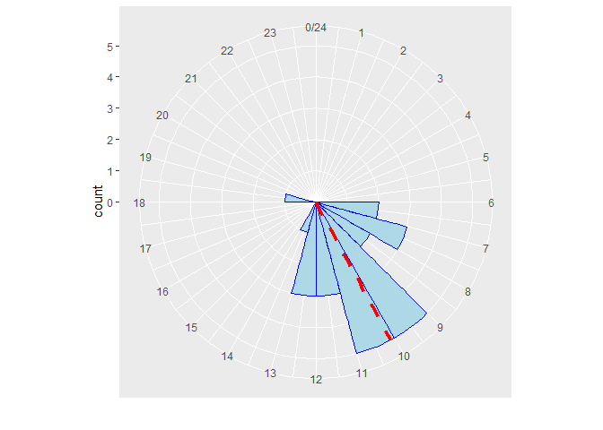<!-- -->

因此发现有一个出现在晚上6点半左右，那么就算异常。

<input type="checkbox" id="checkbox1" class="styled">预测置信区间。

``` r
# Estimate the periodic mean and concentration on the first 24 timestamps
p_mean <- estimates$mu %% 24
concentration <- estimates$kappa

# Estimate densities of all 25 timestamps
densities <- dvonmises(ts, mu = p_mean, kappa = concentration)

# Check if the densities are larger than the cutoff of 95%-CI
cutoff <- dvonmises(qvonmises((1 - .95)/2, mu = p_mean, kappa = concentration), mu = p_mean, kappa = concentration)

# Define the variable time_feature
time_feature <- densities >= cutoff
print(cbind.data.frame(ts, time_feature))
#>           ts time_feature
#> 1   8.730000         TRUE
#> 2   9.297778         TRUE
#> 3  12.939444         TRUE
#> 4  12.458889         TRUE
#> 5  10.989722         TRUE
#> 6   7.379167         TRUE
#> 7  11.233056         TRUE
#> 8  10.223889         TRUE
#> 9  10.116944         TRUE
#> 10  6.165556         TRUE
#> 11 12.721389         TRUE
#> 12  7.126389         TRUE
#> 13  9.612222         TRUE
#> 14 10.750000         TRUE
#> 15  8.460000         TRUE
#> 16  7.926389         TRUE
#> 17 11.548889         TRUE
#> 18 13.309722         TRUE
#> 19 11.164167         TRUE
#> 20  9.775833         TRUE
#> 21  6.986667         TRUE
#> 22 10.326667         TRUE
#> 23  9.663056         TRUE
#> 24  9.662778         TRUE
#> 25 18.398333        FALSE
# time_feature == FALSE => outlier.
```

<input type="checkbox" id="checkbox1" class="styled"> 这个人可以follow

<input type="checkbox" id="checkbox1" class="styled"> segment的代码增加

von Mises probability distribution

# Frequency feature

查询一个用户不同渠道重复的频率。

``` r
trans_Bob <- 
    plyr::join_all(
        list(
            fread(here::here('data','trans_Bob01.csv'))
            ,fread(here::here('data','trans_Bob02.csv'))
            ,fread(here::here('data','trans_Bob03.csv'))
        )
        ,by ='id'
        ,type = 'left'
    )
```

``` r
# Frequency feature based on channel_cd
frequency_fun <- function(steps, channel) {
  n <- length(steps)
  frequency <- sum(channel[1:n] == channel[n + 1])
  # The value of the current rows is equal to the previous rows.
  # Count 1.
  return(frequency)
}

# Create freq_channel feature
freq_channel <- 
    zoo::rollapply(
        trans_Bob$transfer_id
        ,width = list(-1:-length(trans_Bob$transfer_id))
        ,partial = TRUE
        ,FUN = frequency_fun
        ,trans_Bob$channel_cd
        )

length(freq_channel)
#> [1] 16

# Print the features channel_cd, freq_channel and fraud_flag next to each other
freq_channel <- c(0, freq_channel)
freq_channel_tbl01 <- 
    cbind.data.frame(trans_Bob$channel_cd, freq_channel, trans_Bob$fraud_flag) %>% 
    set_names('channel_cd','freq_channel','fraud_flag')
```

Another way.

``` r
freq_channel_tbl02 <- 
    trans_Bob %>% 
    mutate(channel_cd = factor(channel_cd)) %>% 
    group_by(account_name,channel_cd) %>% 
    arrange(timestamp) %>% 
    mutate(freq_channel = row_number()-1) %>% 
    ungroup() %>% 
    select(-account_name) %>% 
    select('channel_cd','freq_channel','fraud_flag')
```

``` r
setequal(freq_channel_tbl01,freq_channel_tbl02)
#> TRUE
```

``` r
freq_channel_tbl02 %>% 
    tail
#> # A tibble: 6 x 3
#>   channel_cd freq_channel fraud_flag
#>   <fct>             <dbl>      <int>
#> 1 CH07                  6          0
#> 2 CH06                  3          0
#> 3 CH02                  2          0
#> 4 CH07                  7          0
#> 5 CH06                  4          0
#> 6 CH05                  0          1
```

注意欺诈发生于`freq_channel=0`的时候，这是freq feature的作用。

# Recency features

<input type="checkbox" id="checkbox1" class="styled"> how to add bracket
in
ggplot

``` r
knitr::include_graphics(here::here('pic','recencyfeature.png'))
```

<!-- -->

\[\text{recency} = e^{-\gamma t}\]

1.  \(e^n|n<0 \in (0,1)\)
2.  \(t\) is time interval between two consecutive events of the same
    type
3.  \(\gamma\) close to 0 (e.g. 0.01, 0.02, 0.05), control \(t\) effect

<!-- end list -->

``` r
expand.grid(
    time_interval = 0:350
    ,gamma = c(0.01,0.02,0.05,0.10,0.20)
) %>% 
    mutate(recency = exp(-time_interval*gamma)
           ,text = glue::glue('gamma is {gamma}')
           ) %>% 
    ggplot(aes(x = time_interval,y = recency, col = text)) +
    geom_line()
```

<!-- -->

1.  recency descreases by time interval.
2.  recency desceases more by gamma increasing.

<!-- end list -->

``` r
recency_fun <- function(t, gamma, auth_cd, freq_auth) {
    n_t <- length(t)
    if (freq_auth[n_t] == 0) {
        recency <- 0 # recency = 0 when frequency = 0
    } else {
        time_diff <- t[1] - max(t[2:n_t][auth_cd[(n_t-1):1] == auth_cd[n_t]]) # time-interval = current timestamp
        # - timestamp of previous transfer with same auth_cd
        recency <- exp(-gamma * time_diff) 
    }
    return(recency) 
    }
```

``` r
trans <- 
    plyr::join_all(
        list(
            fread(here::here('data','trans01.csv'))
            ,fread(here::here('data','trans02.csv'))
            ,fread(here::here('data','trans03.csv'))
        )
        ,by ='id'
        ,type = 'left'
    )
```

``` r
freq_channel_data <- 
    trans %>% 
    arrange(timestamp) %>% 
    group_by(account_name,channel_cd) %>% 
    mutate(
        time_diff = timestamp-lag(timestamp)
        ,gamma = 0.05116856
        ,rec_channel = 
            ifelse(freq_channel == 0,0,exp(-time_diff*gamma))
            # if (freq_channel == 0) {
            #   print(0)
            # } else {
            #   print(exp(-time_diff*gamma))
            # }
    ) %>% 
    select(account_name, channel_cd, timestamp,freq_channel, rec_channel, fraud_flag)
```

注意`rec_channel=0`产生了欺诈行为。

``` r
transfers %>% 
    
    mutate(channel_cd = factor(channel_cd)) %>% 
    
    # Freq feature
    group_by(orig_account_id,channel_cd) %>% 
    arrange(timestamp) %>% 
    mutate(freq_channel = row_number()-1) %>% 
    ungroup() %>% 
    
    # Rec feature

    group_by(orig_account_id,channel_cd) %>% 
    mutate(
        time_diff = timestamp-lag(timestamp)
        ,gamma = 0.05116856
        ,rec_channel = 
            ifelse(freq_channel == 0,0,exp(-time_diff*gamma))
    ) %>% 
    ungroup() %>% 
    
    # summary
    group_by(fraud_flag) %>% 
    select(freq_channel, rec_channel) %>% 
    nest() %>% 
    transmute(desc = map(data,psych::describe)) %>% 
    unnest()
#> # A tibble: 4 x 13
#>    vars     n    mean      sd median trimmed   mad   min     max   range
#>   <int> <dbl>   <dbl>   <dbl>  <dbl>   <dbl> <dbl> <dbl>   <dbl>   <dbl>
#> 1     1   614 3.50e+1 3.30e+1   25   3.02e+1  29.7     0 1.37e+2 1.37e+2
#> 2     2   614 6.07e-2 2.28e-1    0   1.45e-3   0       0 1.00e+0 1.00e+0
#> 3     1    14 3.09e+1 3.49e+1   12.5 2.94e+1  18.5     0 8.00e+1 8.00e+1
#> 4     2    14 1.39e-4 5.20e-4    0   5.22e-7   0       0 1.94e-3 1.94e-3
#> # ... with 3 more variables: skew <dbl>, kurtosis <dbl>, se <dbl>
```

目前欺诈用户的统计指标在这两种变量中差异很大。

# Network features

<input type="checkbox" id="checkbox1" class="styled">chai: 小样本进行分析

## Intro

``` r
# Load the igraph library
library(igraph)
transfers <- fread(here::here('data','transfer_chp2.csv'))

# Have a look at the data
head(transfers)
#> # A tibble: 6 x 7
#>      V1 originator beneficiary amount time  benef_country payment_channel
#>   <int> <chr>      <chr>        <dbl> <chr> <chr>         <chr>          
#> 1     1 I47        I87         1464.  15:12 CAN           CHAN_01        
#> 2     2 I40        I61          143.  15:40 GBR           CHAN_01        
#> 3     3 I89        I61           53.3 11:44 GBR           CHAN_05        
#> 4     4 I24        I52          226.  14:55 GBR           CHAN_03        
#> 5     5 I40        I87         1151.  21:20 CAN           CHAN_03        
#> 6     6 I63        I54          110.  20:21 GBR           CHAN_03
nrow(transfers)
#> [1] 60

# Create an undirected network from the dataset
net <- graph_from_data_frame(transfers, directed = F)
net
#> IGRAPH 5e0b916 UN-- 82 60 -- 
#> + attr: name (v/c), beneficiary (e/c), amount (e/n), time (e/c),
#> | benef_country (e/c), payment_channel (e/c)
#> + edges from 5e0b916 (vertex names):
#>  [1] 1 --I47 2 --I40 3 --I89 4 --I24 5 --I40 6 --I63 7 --I40 8 --I28
#>  [9] 9 --I40 10--I44 11--I23 12--I41 13--I93 14--I28 15--I23 16--I28
#> [17] 17--I40 18--I28 19--I63 20--I52 21--I25 22--I23 23--I28 24--I28
#> [25] 25--I69 26--I15 27--I23 28--I44 29--I21 30--I77 31--I24 32--I76
#> [33] 33--I44 34--I23 35--I17 36--I28 37--I81 38--I23 39--I24 40--I44
#> [41] 41--I37 42--I24 43--I41 44--I69 45--I23 46--I81 47--I11 48--I47
#> [49] 49--I44 50--I44 51--I47 52--I28 53--I77 54--I24 55--I87 56--I23
#> + ... omitted several edges
# Plot the network with the vertex labels in bold and black
plot(net,
     vertex.label.color = 'black',
     vertex.label.font = 2)
```

<!-- -->

``` r
edges <- fread(here::here('data','edges.csv')) %>% 
    select(-id)
# Load igraph and create a network from the data frame
net <- graph_from_data_frame(edges, directed = FALSE)

# Plot the network with the multiple edges
plot(net, layout = layout.circle)
```

<!-- -->

``` r

# Specify new edge attributes width and curved
E(net)$width <- count.multiple(net)
E(net)$curved <- FALSE

# Check the new edge attributes and plot the network with overlapping edges
edge_attr(net)
#> $width
#>  [1] 7 7 7 7 7 7 7 1 1 1 4 4 4 4 1 1
#> 
#> $curved
#>  [1] FALSE FALSE FALSE FALSE FALSE FALSE FALSE FALSE FALSE FALSE FALSE
#> [12] FALSE FALSE FALSE FALSE FALSE
plot(net, layout = layout.circle)
```

<!-- -->

> Fraudsters tend to cluster together:
> 
> 1.  are attending the same events/activities
> 2.  are involved in the same crimes
> 3.  use the same resources
> 4.  are sometimes one and the same person (identity theft)

  - Homophily in social networks (from sociology)  
    People have a strong tendency to associate with other whom they
    perceive as being similar to themselves in some way.
  - Homophily in fraud networks  
    Fraudsters are more likely to be connected to other fraudsters, and
    legitimate people are more likely to be connected to other
    legitimate people.

<mark>因此对于VIP识别的数据，VIP用户也存在 Homophily。</mark>

  - Non-relational model  
    sample independent
    Behavior of one node might influence behavior of other nodes
    Correlated behavior between nodes
  - Relational model  
    Relational neighbor classifier
    The relational neighbor classifier, in particular, predicts a node’s
    class based on its neighboring nodes and adjacent edges. (这是算法逻辑)

因此传统的非关系模型可能不work，也是有原因的。

1.  `account_type` is a nominal variable -\> use
    `assortativity_nominal`.

<!-- end list -->

``` r
# Add account_type as an attribute to the nodes of the network
V(net)$account_type <- account_info$type

# Have a look at the vertex attributes
print(vertex_attr(net))

# Check for homophily based on account_type
assortativity_nominal(net, types = V(net)$account_type, directed = FALSE)
# 0.1810621
```

> The assortativity coefficient is positive which means that accounts of
> the same type tend to connect to each other.

这个地方的例子没理解。

``` r
# Each account type is assigned a color
vertex_colors <- c("grey", "lightblue", "darkorange")

# Add attribute color to V(net) which holds the color of each node depending on its account_type
V(net)$color <- vertex_colors[V(net)$account_type]

# Plot the network
plot(net)
```

同类型的用户聚集。

  - money mule  
    A money mule or sometimes referred to as a “smurfer” is a person who
    transfers money acquired illegally.

<!-- end list -->

``` r
transfers <- fread(here::here('data','transfers_chp2_02.csv'))
account_info <- fread(here::here('data','account_info.csv'))

# From data frame to graph
net <- graph_from_data_frame(transfers, directed = FALSE)

# Plot the network; color nodes according to isMoneyMule-variable
V(net)$color <- ifelse(account_info$isMoneyMule, "darkorange", "slateblue1")
plot(net, vertex.label.color = "black", vertex.label.font = 2, vertex.size = 18)

# Find the id of the money mule accounts
print(account_info$id[account_info$isMoneyMule == TRUE])

# Create subgraph containing node "I41" and all money mules nodes
subnet <- subgraph(net, v = c("I41", "I47", "I87", "I20"))
# Error in as.igraph.vs(graph, v) : Invalid vertex names

# Compute the money mule probability of node "I41" based on the neighbors
strength(subnet, v = "I41") / strength(net, v = "I41")
# Error in "igraph" %in% class(graph) : 找不到对象'subnet'
```

为什么箭头没有显示出来。

1.  `as_data_frame(x, what = c("edges", "vertices", "both"))`
    可以将`igraph`的对象变成`data.frame`。
2.  `vertex_*` n. 顶点；头顶；天顶，也就是Nodes的意思。

## Feature Engineering

There are three kinds of variable we can build.

1.    - Degree  
        Number of edges.
        If Network has N nodes, then normalizing means dividing by N − 1

2.    - Closeness  
        Inverse distance of a node to all other nodes in the network
        \((1+1+2)^{-1}\)
        normalized - \((\frac{(1+1+2)}{3})^{-1}\)

3.    - Betweenness  
        Number of times that a node or edge occurs in the geodesics of
        the network
        normalized - \(\frac{...}{N}\)

<!-- end list -->

``` r
kite <- fread(here::here('data','kite.csv')) %>% 
    select(-id)
kite <- graph_from_data_frame(kite,directed = F)
plot(kite)
```

<!-- -->

### degree

``` r
# Find the degree of each node
degree(kite)
#>  1  2  3  4  5  6  7  8  9 10 
#>  4  4  3  6  3  5  5  3  2  1

# Which node has the largest degree?
which.max(degree(kite))
#> 4 
#> 4

# Plot kite with vertex.size proportional to the degree of each node
plot(kite, vertex.size = 6 * degree(kite))
```

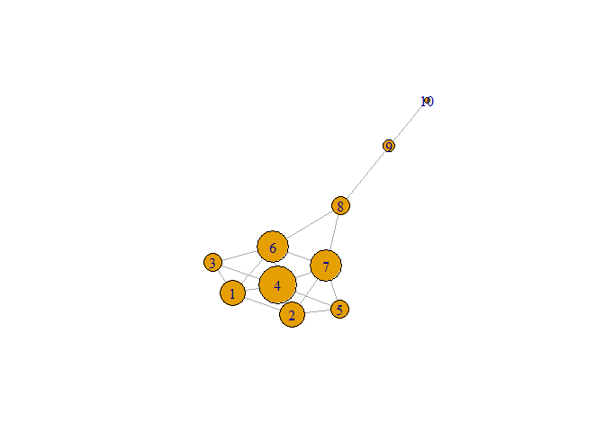<!-- -->

### Closeness

``` r
# Find the closeness of each node
closeness(kite)
#>          1          2          3          4          5          6 
#> 0.05882353 0.05882353 0.05555556 0.06666667 0.05555556 0.07142857 
#>          7          8          9         10 
#> 0.07142857 0.06666667 0.04761905 0.03448276

# Which node has the largest closeness?
which.max(closeness(kite))
#> 6 
#> 6

# Plot kite with vertex.size proportional to the closeness of each node
plot(kite, vertex.size = 500 * closeness(kite))
```

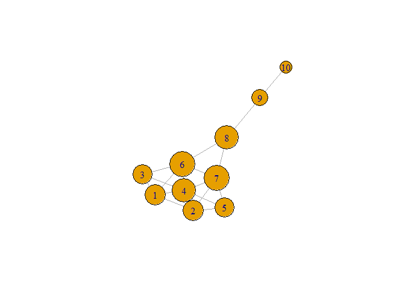<!-- -->

### betweenness

``` r
# Find the betweenness of each node
betweenness(kite)
#>          1          2          3          4          5          6 
#>  0.8333333  0.8333333  0.0000000  3.6666667  0.0000000  8.3333333 
#>          7          8          9         10 
#>  8.3333333 14.0000000  8.0000000  0.0000000

# Which node has the largest betweenness?
which.max(betweenness(kite))
#> 8 
#> 8

# Plot kite with vertex.size proportional to the betweenness of each node
plot(kite, vertex.size = 5 * betweenness(kite))
```

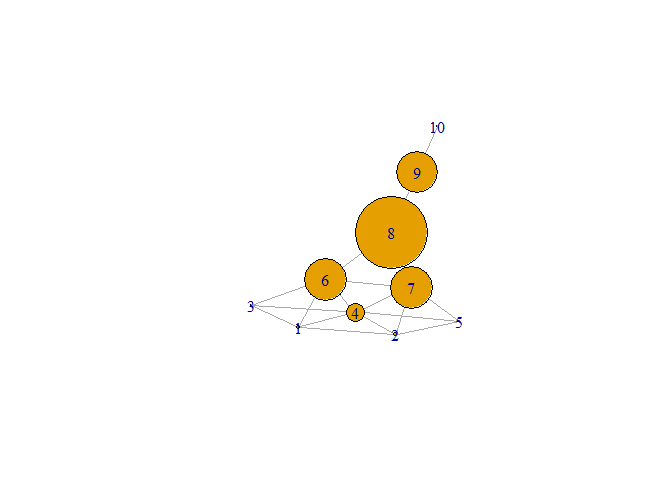<!-- -->

``` r
net <- fread(here::here('data','net.csv')) %>% 
    select(-id)
net <- graph_from_data_frame(net,directed = F)
account_info <- fread(here::here('data','account_info_chp2.csv')) %>% 
    select(-index)
```

### Combination of the new features

``` r
# Plot network and print account info
plot(net)
legend("bottomleft", legend = c("known money mule", "legit account"), fill = c("darkorange", "lightblue"), bty = "n")
```

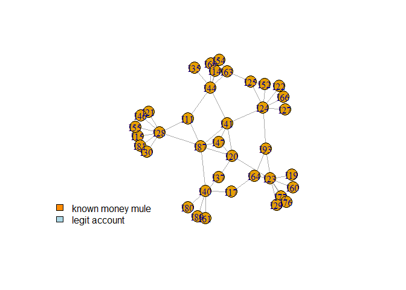<!-- -->

``` r
print(account_info)
#>      id isMoneyMule type
#>  1: I47        TRUE    3
#>  2: I40       FALSE    3
#>  3: I89       FALSE    1
#>  4: I24       FALSE    2
#>  5: I63       FALSE    2
#>  6: I28       FALSE    1
#>  7: I44       FALSE    1
#>  8: I23       FALSE    1
#>  9: I41        TRUE    3
#> 10: I93       FALSE    2
#> 11: I52       FALSE    2
#> 12: I25       FALSE    1
#> 13: I69       FALSE    2
#> 14: I15       FALSE    1
#> 15: I21       FALSE    2
#> 16: I77       FALSE    1
#> 17: I76       FALSE    2
#> 18: I17       FALSE    1
#> 19: I81       FALSE    1
#> 20: I37       FALSE    3
#> 21: I11       FALSE    3
#> 22: I87        TRUE    3
#> 23: I61       FALSE    1
#> 24: I54       FALSE    1
#> 25: I80       FALSE    1
#> 26: I20        TRUE    3
#> 27: I64       FALSE    2
#> 28: I46       FALSE    2
#> 29: I19       FALSE    2
#> 30: I55       FALSE    1
#> 31: I14       FALSE    1
#> 32: I30       FALSE    2
#> 33: I29       FALSE    2
#> 34: I35       FALSE    2
#> 35: I27       FALSE    2
#> 36: I60       FALSE    1
#> 37: I22       FALSE    1
#> 38: I66       FALSE    2
#>      id isMoneyMule type

# Degree
account_info$degree <- degree(net, normalized = T)
# degree colname is I47 or something.

# Closeness
account_info$closeness <- closeness(net, normalized = T)

# Betweenness
account_info$betweenness <- betweenness(net, normalized = T)

print(account_info)
#>      id isMoneyMule type     degree closeness  betweenness
#>  1: I47        TRUE    3 0.08108108 0.3775510 0.0000000000
#>  2: I40       FALSE    3 0.16216216 0.3425926 0.1979479479
#>  3: I89       FALSE    1 0.05405405 0.2587413 0.0000000000
#>  4: I24       FALSE    2 0.18918919 0.3737374 0.2600100100
#>  5: I63       FALSE    2 0.13513514 0.2983871 0.0350350350
#>  6: I28       FALSE    1 0.21621622 0.3627451 0.2942942943
#>  7: I44       FALSE    1 0.18918919 0.3663366 0.2209709710
#>  8: I23       FALSE    1 0.21621622 0.3592233 0.2757757758
#>  9: I41        TRUE    3 0.13513514 0.4352941 0.2817817818
#> 10: I93       FALSE    2 0.08108108 0.3274336 0.0838338338
#> 11: I52       FALSE    2 0.05405405 0.2846154 0.0000000000
#> 12: I25       FALSE    1 0.08108108 0.2781955 0.0000000000
#> 13: I69       FALSE    2 0.08108108 0.2720588 0.0007507508
#> 14: I15       FALSE    1 0.05405405 0.2700730 0.0000000000
#> 15: I21       FALSE    2 0.08108108 0.2700730 0.0000000000
#> 16: I77       FALSE    1 0.08108108 0.2700730 0.0000000000
#> 17: I76       FALSE    2 0.05405405 0.3032787 0.0315315315
#> 18: I17       FALSE    1 0.05405405 0.3217391 0.0155155155
#> 19: I81       FALSE    1 0.08108108 0.2720588 0.0007507508
#> 20: I37       FALSE    3 0.08108108 0.3663366 0.0950950951
#> 21: I11       FALSE    3 0.16216216 0.4352941 0.3753753754
#> 22: I87        TRUE    3 0.05405405 0.2587413 0.0000000000
#> 23: I61       FALSE    1 0.05405405 0.2761194 0.0000000000
#> 24: I54       FALSE    1 0.02702703 0.2569444 0.0000000000
#> 25: I80       FALSE    1 0.13513514 0.4157303 0.2309809810
#> 26: I20        TRUE    3 0.08108108 0.3057851 0.0385385385
#> 27: I64       FALSE    2 0.05405405 0.2700730 0.0000000000
#> 28: I46       FALSE    2 0.02702703 0.2661871 0.0000000000
#> 29: I19       FALSE    2 0.05405405 0.2700730 0.0000000000
#> 30: I55       FALSE    1 0.08108108 0.2781955 0.0000000000
#> 31: I14       FALSE    1 0.08108108 0.3008130 0.0347847848
#> 32: I30       FALSE    2 0.05405405 0.2700730 0.0000000000
#> 33: I29       FALSE    2 0.08108108 0.2700730 0.0000000000
#> 34: I35       FALSE    2 0.02702703 0.2700730 0.0000000000
#> 35: I27       FALSE    2 0.02702703 0.2740741 0.0000000000
#> 36: I60       FALSE    1 0.02702703 0.2661871 0.0000000000
#> 37: I22       FALSE    1 0.02702703 0.2740741 0.0000000000
#> 38: I66       FALSE    2 0.02702703 0.2740741 0.0000000000
#>      id isMoneyMule type     degree closeness  betweenness
account_info %>% distinct(type)
#> # A tibble: 3 x 1
#>    type
#>   <int>
#> 1     3
#> 2     1
#> 3     2
```

1.  接下来可以使用 non relational model 进行分析了，例如决策树。
2.  但是数据还是存在imbalance的问题，因此需要处理。

<input type="checkbox" id="checkbox1" class="styled"> 如何用SQL 翻译?
<input type="checkbox" id="checkbox1" class="styled"> 先整理 PPT

# Imbalanced class distributions

<input type="checkbox" id="checkbox1" class="styled"> xs
的数据也存在不平衡的问题，因此变量需要进行以上特征工程。

1.  准备每个x的inserttime

sampling 只对 train 进行而不对 test 进行

<input type="checkbox" id="checkbox1" class="styled"> 复现PPT Chp3

[Kaggle](https://www.kaggle.com/mlg-ulb/creditcardfraud)的反欺诈数据。

``` r
library(data.table)
creditcard <- fread(here::here('data','creditcard.csv'))
creditcard %>% 
    mutate(index = rep_len(1:4,nrow(.))) %>% 
    group_by(index) %>% 
    nest() %>% 
    mutate(data1 = map2(data,index,~write_excel_csv(.x,here::here('data',paste0('creditcard_',.y,'.csv')))))
```

``` r
library(data.table)
library(tidyverse)
creditcard <- 
    bind_rows(
        map(1:4
            ,~ paste0('creditcard_',.,'.csv') %>% 
            here::here('data',.) %>% 
            fread()
            )
        
    ) %>% 
    dplyr::sample_frac(0.1)
```

``` r
creditcard %>% 
    # nrow
    pryr::object_size()
#> 7.07 MB
```

``` r
creditcard %>% 
    ggplot(aes(V1,V2,col=factor(Class))) +
    geom_point(alpha=0.2)
```

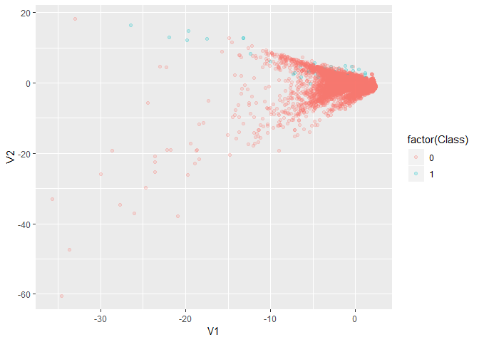<!-- -->

``` r
# imbalance is an issue.
```

``` r
creditcard %>% 
    group_by(Class) %>% 
    count() %>% 
    ungroup() %>% 
    mutate(n = n/sum(n))
#> # A tibble: 2 x 2
#>   Class       n
#>   <int>   <dbl>
#> 1     0 0.998  
#> 2     1 0.00162
```

Use `ovun.sample` from `ROSE` package to do over/under - sampling or
combination of the two.

## Oversampling

``` r
# We hope minority in the new sample is 40%.
# We know majority size is 
sum(creditcard$Class == 0)
#> [1] 28435
# sum(creditcard$Class == 0)/(1-0.4) is the desired sample size.
library(ROSE)
oversampling_result <- 
    ovun.sample(
        Class ~ .
        ,data = creditcard
        ,method = "over"
        ,N = sum(creditcard$Class == 0)/(1-0.4)
        ,seed = 2018)
# N - the sampling size you want.
oversampled_credit <- oversampling_result$data
table(oversampled_credit$Class)
#> 
#>     0     1 
#> 28435 18956
table(creditcard$Class)
#> 
#>     0     1 
#> 28435    46
prop.table(table(oversampled_credit$Class))
#> 
#>         0         1 
#> 0.6000084 0.3999916
prop.table(table(creditcard$Class))
#> 
#>           0           1 
#> 0.998384888 0.001615112
```

完成sampling的工作。

``` r
oversampled_credit %>% 
    ggplot(aes(V1,V2,col=factor(Class))) +
    scale_color_manual(values = c('dodgerblue', 'red')) +
    # customize the color for the points.
    geom_point(alpha=0.2)
```

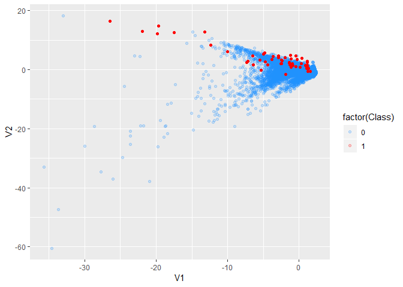<!-- -->

``` r
# imbalance is solved.
```

## Undersampling

``` r
# We hope minority in the new sample is 40%.
# We know minority size is 
sum(creditcard$Class == 1)
#> [1] 46
# sum(creditcard$Class == 1)/0.4 is the desired sample size.
undersampling_result <- 
    ovun.sample(
        Class ~ .
        ,data = creditcard
        ,method = "under"
        ,N = sum(creditcard$Class == 1)/0.4
        ,seed = 2018)
# N - the sampling size you want.
undersampled_credit <- undersampling_result$data
table(undersampled_credit$Class)
#> 
#>  0  1 
#> 69 46
prop.table(table(undersampled_credit$Class))
#> 
#>   0   1 
#> 0.6 0.4
```

``` r
undersampled_credit %>% 
    ggplot(aes(V1,V2,col=factor(Class))) +
    scale_color_manual(values = c('dodgerblue', 'red')) +
    geom_point(alpha=0.2)
```

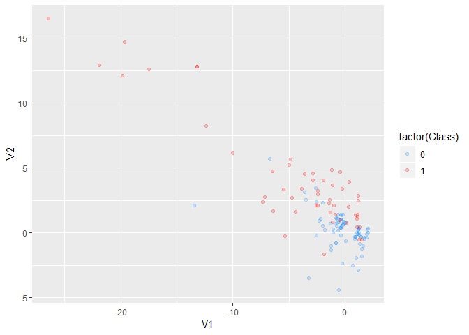<!-- -->

``` r
# imbalance is solved.
```

## Over and Undersampling

``` r
bothsampling_result <- 
    ovun.sample(
        Class ~ .
        ,data = creditcard
        ,method = "both"
        ,N = nrow(creditcard)
        ,p = 0.5
        ,seed = 2018)
# N - the sampling size you want.
bothsampled_credit <- bothsampling_result$data
table(bothsampled_credit$Class)
#> 
#>     0     1 
#> 14365 14116
prop.table(table(bothsampled_credit$Class))
#> 
#>         0         1 
#> 0.5043713 0.4956287
table(creditcard$Class)
#> 
#>     0     1 
#> 28435    46
# both actions are done.
# oversampling the majority 
# undersampling the minority.
```

``` r
bothsampled_credit %>% 
    ggplot(aes(V1,V2,col=factor(Class))) +
    scale_color_manual(values = c('dodgerblue', 'red')) +
    geom_point(alpha=0.2)
```

<!-- -->

``` r
# imbalance is solved.
```

## SMOTE

Chawla et al. (2002) 提出SMOTE方法，用于解决不平衡样本的问题。

### intro


如图，红色点表示欺诈用户在两变量上的表现，分别连线。


任意选择一点。


选择任意比例，构建两点间的一个样本。

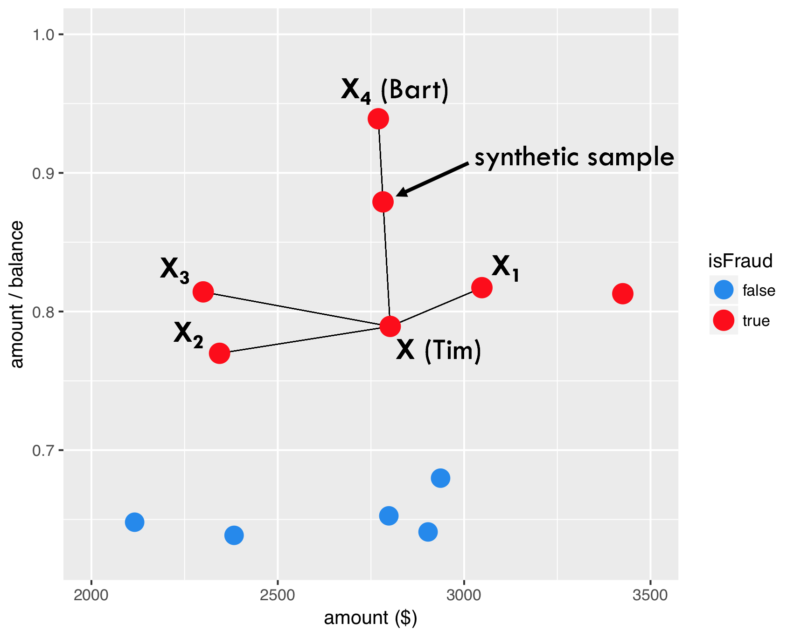

因此，SMOTE产生的新样本出现了。

> `dup_size` parameter answers the question how many times SMOTE should
> loop through the existing, real fraud cases.

同时参数`dup_size`给定SMOTE算法需要给每个`y=1`产生多少个新的样本。

### modeling

``` r
library(smotefamily)
```

> SMOTE can only be applied based on numeric variables since it uses the
> euclidean distance to determine nearest
neighbors.

``` r
# Set the number of fraud and legitimate cases, and the desired percentage of legitimate cases
n1 <- sum(creditcard$Class==1)
n0 <- sum(creditcard$Class==0)
r0 <- 0.6
# r0: the desired percentage

# Calculate the value for the dup_size parameter of SMOTE
ntimes <- ((1 - r0) / r0) * (n0 / n1) - 1

# Create synthetic fraud cases with SMOTE
library(data.table)
smote_output <- SMOTE(X = creditcard %>% select(-Time,Class), target = creditcard$Class, K = 5, dup_size = ntimes)
# remove non-numeric vars

# Make a scatter plot of the original and over-sampled dataset
credit_smote <- smote_output$data
colnames(credit_smote)[30] <- "Class"
prop.table(table(credit_smote$Class))
#> 
#>         0         1 
#> 0.6000591 0.3999409

ggplot(creditcard, aes(x = V1, y = V2, color = factor(Class))) +
    geom_point() +
    scale_color_manual(values = c('dodgerblue2', 'red'))
```

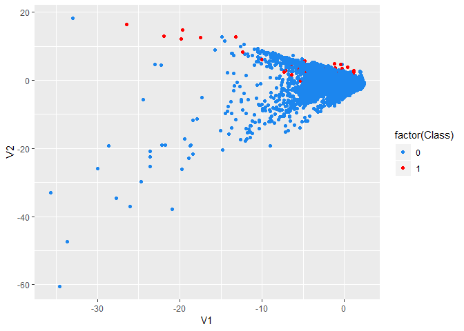<!-- -->

``` r

ggplot(credit_smote, aes(x = V1, y = V2, color = factor(Class))) +
  geom_point() +
  scale_color_manual(values = c('dodgerblue2', 'red'))
```

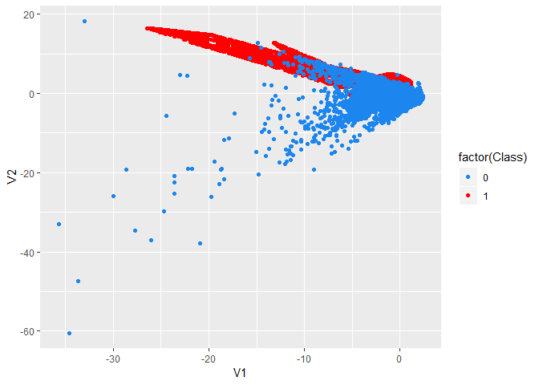<!-- -->

1.  你会发现，通过SMOTE算法，以后很多点连成了直线，具体见 @ref(smoteintro)

<details>

<summary>报错`Errorin knearest(P_set, P_set, K) : 找不到对象'knD'`</summary>

1.  函数为`smotefamily::SMOTE` 1
    [CSDN博客](https://blog.csdn.net/scc_hy/article/details/84190080)介绍其他的R中SMOTE的包
2.  解决办法是`install.packages("FNN")` 参考 [Stack
    Overflow](https://stackoverflow.com/questions/40206172/error-in-knearestdarr-p-set-k-object-knd-not-found?answertab=oldest)

</details>

1.  <input type="checkbox" id="checkbox1" class="styled">`ntimes <- ((1
    - r0) / r0) * (n0 / n1) - 1`理解公式

### split train and test

这里用于验证SMOTE方法是否有提高模型效果。

``` r
dim(creditcard)
#> [1] 28481    31
set.seed(123)
creditcard <- creditcard %>% mutate(Class = as.factor(Class))
train_index <- sample(nrow(creditcard),round(0.5*nrow(creditcard)))
train <- creditcard[train_index,]
test <- creditcard[-train_index,]
```

``` r
library(rpart)
model01 <-  rpart(factor(Class) ~ ., data = train)
library(caret)
scores01 <- predict(model01,newdata=test,type = "prob")[,2]
predicted_class01 <- ifelse(scores01>0.5,1,0) %>% factor()
confusionMatrix(
    data = predicted_class01
    ,reference = test$Class
)
#> Confusion Matrix and Statistics
#> 
#>           Reference
#> Prediction     0     1
#>          0 14211    10
#>          1     6    14
#>                                           
#>                Accuracy : 0.9989          
#>                  95% CI : (0.9982, 0.9994)
#>     No Information Rate : 0.9983          
#>     P-Value [Acc > NIR] : 0.05611         
#>                                           
#>                   Kappa : 0.6358          
#>  Mcnemar's Test P-Value : 0.45325         
#>                                           
#>             Sensitivity : 0.9996          
#>             Specificity : 0.5833          
#>          Pos Pred Value : 0.9993          
#>          Neg Pred Value : 0.7000          
#>              Prevalence : 0.9983          
#>          Detection Rate : 0.9979          
#>    Detection Prevalence : 0.9986          
#>       Balanced Accuracy : 0.7915          
#>                                           
#>        'Positive' Class : 0               
#> 

library(pROC)
auc(roc(response = test$Class, predictor = scores01))
#> Area under the curve: 0.7915
```

``` r
library(smotefamily) 
set.seed(123)
smote_result <- SMOTE(X = train %>% select(-Class),target = train$Class,K = 10, dup_size = 50)
train_oversampled <- 
    smote_result$data %>% 
    mutate(Class = class)
```

``` r
prop.table(table(train$Class))
#> 
#>           0           1 
#> 0.998455056 0.001544944
prop.table(table(train_oversampled$Class))
#> 
#>          0          1 
#> 0.92685789 0.07314211
```

``` r
library(rpart)
model02<- rpart(Class ~ ., data = train_oversampled)
```

``` r
library(rpart)
model02 <-  rpart(factor(Class) ~ ., data = train)
library(caret)
scores02 <- predict(model02,newdata=test,type = "prob")[,2]
predicted_class02 <- ifelse(scores02>0.5,1,0) %>% factor()
confusionMatrix(
    data = predicted_class02
    ,reference = test$Class
)
#> Confusion Matrix and Statistics
#> 
#>           Reference
#> Prediction     0     1
#>          0 14211    10
#>          1     6    14
#>                                           
#>                Accuracy : 0.9989          
#>                  95% CI : (0.9982, 0.9994)
#>     No Information Rate : 0.9983          
#>     P-Value [Acc > NIR] : 0.05611         
#>                                           
#>                   Kappa : 0.6358          
#>  Mcnemar's Test P-Value : 0.45325         
#>                                           
#>             Sensitivity : 0.9996          
#>             Specificity : 0.5833          
#>          Pos Pred Value : 0.9993          
#>          Neg Pred Value : 0.7000          
#>              Prevalence : 0.9983          
#>          Detection Rate : 0.9979          
#>    Detection Prevalence : 0.9986          
#>       Balanced Accuracy : 0.7915          
#>                                           
#>        'Positive' Class : 0               
#> 

library(pROC)
auc(roc(response = test$Class, predictor = scores02))
#> Area under the curve: 0.7915
```

SMOTE 并不是每次都有效果，因此要通过这种方法进行验证。

### cost model

在不平衡样本中，ACC是有误导的，因此引入成本矩阵。

``` r
here::here('pic','cost_matrix.png') %>% 
    knitr::include_graphics()
```

<!-- -->

<input type="checkbox" id="checkbox1" class="styled">SMOTE : Synthetic
Minority Oversampling TEchnique (Chawla et al., 2002)

1.  你会发现，通过SMOTE算法，以后很多点连成了直线，具体见 @ref(smoteintro)

<details>

<summary>报错`Errorin knearest(P_set, P_set, K) : 找不到对象'knD'`</summary>

1.  函数为`smotefamily::SMOTE` 1
    [CSDN博客](https://blog.csdn.net/scc_hy/article/details/84190080)介绍其他的R中SMOTE的包
2.  解决办法是`install.packages("FNN")` 参考 [Stack
    Overflow](https://stackoverflow.com/questions/40206172/error-in-knearestdarr-p-set-k-object-knd-not-found?answertab=oldest)

</details>

1.  <input type="checkbox" id="checkbox1" class="styled">`ntimes <- ((1
    - r0) / r0) * (n0 / n1) - 1`理解公式

### split train and test

这里用于验证SMOTE方法是否有提高模型效果。

``` r
dim(creditcard)
#> [1] 28481    31
set.seed(123)
creditcard <- creditcard %>% mutate(Class = as.factor(Class))
train_index <- sample(nrow(creditcard),round(0.5*nrow(creditcard)))
train <- creditcard[train_index,]
test <- creditcard[-train_index,]
```

``` r
library(rpart)
model01 <-  rpart(factor(Class) ~ ., data = train)
library(caret)
scores01 <- predict(model01,newdata=test,type = "prob")[,2]
predicted_class01 <- ifelse(scores01>0.5,1,0) %>% factor()
confusionMatrix(
    data = predicted_class01
    ,reference = test$Class
)
#> Confusion Matrix and Statistics
#> 
#>           Reference
#> Prediction     0     1
#>          0 14211    10
#>          1     6    14
#>                                           
#>                Accuracy : 0.9989          
#>                  95% CI : (0.9982, 0.9994)
#>     No Information Rate : 0.9983          
#>     P-Value [Acc > NIR] : 0.05611         
#>                                           
#>                   Kappa : 0.6358          
#>  Mcnemar's Test P-Value : 0.45325         
#>                                           
#>             Sensitivity : 0.9996          
#>             Specificity : 0.5833          
#>          Pos Pred Value : 0.9993          
#>          Neg Pred Value : 0.7000          
#>              Prevalence : 0.9983          
#>          Detection Rate : 0.9979          
#>    Detection Prevalence : 0.9986          
#>       Balanced Accuracy : 0.7915          
#>                                           
#>        'Positive' Class : 0               
#> 

library(pROC)
auc(roc(response = test$Class, predictor = scores01))
#> Area under the curve: 0.7915
```

``` r
library(smotefamily) 
set.seed(123)
smote_result <- SMOTE(X = train %>% select(-Class),target = train$Class,K = 10, dup_size = 50)
train_oversampled <- 
    smote_result$data %>% 
    mutate(Class = class)
```

``` r
prop.table(table(train$Class))
#> 
#>           0           1 
#> 0.998455056 0.001544944
prop.table(table(train_oversampled$Class))
#> 
#>          0          1 
#> 0.92685789 0.07314211
```

``` r
library(rpart)
model02<- rpart(Class ~ ., data = train_oversampled)
```

``` r
library(rpart)
model02 <-  rpart(factor(Class) ~ ., data = train)
library(caret)
scores02 <- predict(model02,newdata=test,type = "prob")[,2]
predicted_class02 <- ifelse(scores02>0.5,1,0) %>% factor()
confusionMatrix(
    data = predicted_class02
    ,reference = test$Class
)
#> Confusion Matrix and Statistics
#> 
#>           Reference
#> Prediction     0     1
#>          0 14211    10
#>          1     6    14
#>                                           
#>                Accuracy : 0.9989          
#>                  95% CI : (0.9982, 0.9994)
#>     No Information Rate : 0.9983          
#>     P-Value [Acc > NIR] : 0.05611         
#>                                           
#>                   Kappa : 0.6358          
#>  Mcnemar's Test P-Value : 0.45325         
#>                                           
#>             Sensitivity : 0.9996          
#>             Specificity : 0.5833          
#>          Pos Pred Value : 0.9993          
#>          Neg Pred Value : 0.7000          
#>              Prevalence : 0.9983          
#>          Detection Rate : 0.9979          
#>    Detection Prevalence : 0.9986          
#>       Balanced Accuracy : 0.7915          
#>                                           
#>        'Positive' Class : 0               
#> 

library(pROC)
auc(roc(response = test$Class, predictor = scores02))
#> Area under the curve: 0.7915
```

SMOTE 并不是每次都有效果，因此要通过这种方法进行验证。

### cost model

在不平衡样本中，ACC是有误导的，因此引入成本矩阵。

``` r
here::here('pic','cost_matrix.png') %>% 
    knitr::include_graphics()
```

<!-- -->

如图，一共有两种成本

<input type="checkbox" id="checkbox1" class="styled">仿照PPT出题

1.  Cost of analyzing the case
2.  被欺诈损失的本金

加入SMOTE 的结构后，模型变得更加复杂了，更好了。

因此成本函数可以定义为

`cost_model`
定义。

\[Cost(\text{model})=\sum_{i=1}^{N}y_i(1-\hat y_i)\text{Amount}_i + \hat y_i C_a\]

1.  \(y_i\)为真实值
2.  \(\hat y_i\)为预测值

ACC
是有误导的。

``` r
cost_model <- function(predicted.classes, true.classes, amounts, fixedcost) {
  library(hmeasure)
  predicted.classes <- relabel(predicted.classes)
  true.classes <- relabel(true.classes)
  cost <- sum(true.classes * (1 - predicted.classes) * amounts + predicted.classes * fixedcost)
  return(cost)
}
```

``` r
cost_model(
    predicted.classes = predicted_class01
    ,true.classes = test$Class
    ,amounts = test$Amount
    ,fixedcost = 10
)
#> [1] 3108.4
cost_model(
    predicted.classes = predicted_class02
    ,true.classes = test$Class
    ,amounts = test$Amount
    ,fixedcost = 10
)
#> [1] 3108.4
```

1.  说明SMOTE
算法无效。

# Benford’s law for digits

## Benford’s law for the first digit

\[P(D_1 = d_1) = \log(d_1+1) - \log(d_1) = \log(1 + \frac{1}{d_1});d_1 = 1,\dots,9\]

``` r
benford_data <- 
    tibble(
        d_1 = 1:9
        ,P = log10(d_1+1) - log10(d_1)
    )
benford_data
#> # A tibble: 9 x 2
#>     d_1      P
#>   <int>  <dbl>
#> 1     1 0.301 
#> 2     2 0.176 
#> 3     3 0.125 
#> 4     4 0.0969
#> 5     5 0.0792
#> 6     6 0.0669
#> 7     7 0.0580
#> 8     8 0.0512
#> 9     9 0.0458
benford_data %>% 
    summarise(sum(P))
#> # A tibble: 1 x 1
#>   `sum(P)`
#>      <dbl>
#> 1        1
```

1.  也可以检验概率和为1

## Test on the Fibonacci sequence

> The Fibonacci sequence is characterized by the fact that every number
> after the first two is the sum of the two preceding ones. (Baesens,
> Höppner, and Verdonck 2018)

``` r
n <- 1000
fibnum <- numeric(n)
fibnum[1] <- 1
fibnum[2] <- 1
for (i in 3:n) { 
  fibnum[i] <- fibnum[i-1]+fibnum[i-2]
} 
head(fibnum)
#> [1] 1 1 2 3 5 8
```

``` r
library(benford.analysis)
bfd.fib <- benford(fibnum,
                number.of.digits = 1)
plot(bfd.fib)
```

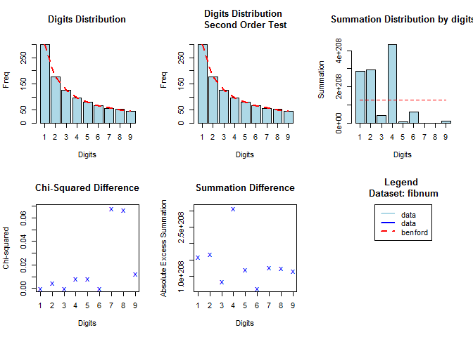<!-- -->

## Test on `census.2009`

  - `census.2009`  
    contains the populations of 19509 towns and cities of the United
    States (July 2009) and was used in Nigrini and Wells (2012).

<!-- end list -->

``` r
# Load package benford.analysis
library(benford.analysis)
data(census.2009)

# Check conformity
bfd.cen <- benford(census.2009$pop.2009, number.of.digits = 1) 
plot(bfd.cen, except = c("second order", "summation", "mantissa", "chi squared","abs diff", "ex summation", "Legend"), multiple = F) 
```

<!-- -->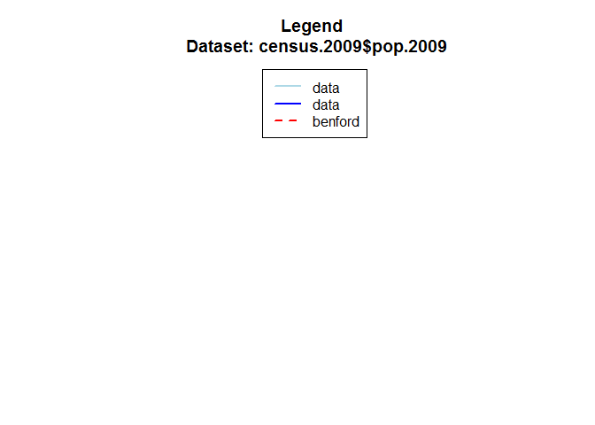<!-- -->

``` r
census.2009 %>% 
    transmute(pop.2009 = pop.2009 %>% 
                  as.character %>% 
                  str_sub(1,1) %>% 
                  as.integer
               ) %>% 
    group_by(pop.2009) %>% 
    count() %>% 
    ungroup() %>% 
    mutate(n = n/sum(n)) %>% 
    mutate(benford = log10(1+1/pop.2009)) %>% 
    gather(key,value,n:benford) %>% 
    ggplot(aes(x=pop.2009,y=value,col=key)) +
    geom_line()
```

<!-- -->

``` r
# Multiply the data by 3 and check conformity again
data <- census.2009$pop.2009 * 3
bfd.cen3 <- benford(data, number.of.digits=1)
plot(bfd.cen3, except = c("second order", "summation", "mantissa", "chi squared","abs diff", "ex summation", "Legend"), multiple = F)
```

<!-- --><!-- -->

1.  因此满足 benford 定律。
2.  `plot.Benford`存在bug。

## Satisfication

Many datasets satisfy Benford’s Law

1.  data where numbers represent sizes of facts or events
2.  data in which numbers have no relationship to each other
3.  data sets that grow exponentially or arise from multiplicative
    fluctuations
4.  mixtures of different data sets
5.  Some well-known infinite integer sequences
    1.  Fibonacci sequence
6.  Preferably, more than 1000 numbers that go across multiple orders.

Such as

1.  accounting transactions
2.  credit card transactions
3.  customer balances
4.  death rates
5.  diameter of planets
6.  electricity and telephone bills
7.  Fibonacci numbers
8.  incomes
9.  insurance claims
10. lengths and flow rates of rivers
11. loan data
12. numbers of newspaper articles
13. physical and mathematical constants
14. populations of cities
15. powers of 2
16. purchase orders
17. stock and house prices
    1.  可以做特征工程

这些可以不用记忆，等之后使用了再融会贯通。 ||||||| merged common ancestors =======

``` r
cost_model(
    predicted.classes = predicted_class01
    ,true.classes = test$Class
    ,amounts = test$Amount
    ,fixedcost = 10
)
#> [1] 3108.4
cost_model(
    predicted.classes = predicted_class02
    ,true.classes = test$Class
    ,amounts = test$Amount
    ,fixedcost = 10
)
#> [1] 3108.4
```

1.  说明SMOTE
算法无效。

# Benford’s law for digits

## Benford’s law for the first digit

\[P(D_1 = d_1) = \log(d_1+1) - \log(d_1) = \log(1 + \frac{1}{d_1});d_1 = 1,\dots,9\]

``` r
benford_data <- 
    tibble(
        d_1 = 1:9
        ,P = log10(d_1+1) - log10(d_1)
    )
benford_data
#> # A tibble: 9 x 2
#>     d_1      P
#>   <int>  <dbl>
#> 1     1 0.301 
#> 2     2 0.176 
#> 3     3 0.125 
#> 4     4 0.0969
#> 5     5 0.0792
#> 6     6 0.0669
#> 7     7 0.0580
#> 8     8 0.0512
#> 9     9 0.0458
benford_data %>% 
    summarise(sum(P))
#> # A tibble: 1 x 1
#>   `sum(P)`
#>      <dbl>
#> 1        1
```

1.  也可以检验概率和为1

## Test on the Fibonacci sequence

> The Fibonacci sequence is characterized by the fact that every number
> after the first two is the sum of the two preceding ones. (Baesens,
> Höppner, and Verdonck 2018)

``` r
n <- 1000
fibnum <- numeric(n)
fibnum[1] <- 1
fibnum[2] <- 1
for (i in 3:n) { 
  fibnum[i] <- fibnum[i-1]+fibnum[i-2]
} 
head(fibnum)
#> [1] 1 1 2 3 5 8
```

``` r
library(benford.analysis)
bfd.fib <- benford(fibnum,
                number.of.digits = 1)
plot(bfd.fib)
```

<!-- -->

## Test on `census.2009`

  - `census.2009`  
    contains the populations of 19509 towns and cities of the United
    States (July 2009) and was used in Nigrini and Wells (2012).

<!-- end list -->

``` r
# Load package benford.analysis
library(benford.analysis)
data(census.2009)

# Check conformity
bfd.cen <- benford(census.2009$pop.2009, number.of.digits = 1) 
plot(bfd.cen, except = c("second order", "summation", "mantissa", "chi squared","abs diff", "ex summation", "Legend"), multiple = F) 
```

<!-- --><!-- -->

``` r
census.2009 %>% 
    transmute(pop.2009 = pop.2009 %>% 
                  as.character %>% 
                  str_sub(1,1) %>% 
                  as.integer
               ) %>% 
    group_by(pop.2009) %>% 
    count() %>% 
    ungroup() %>% 
    mutate(n = n/sum(n)) %>% 
    mutate(benford = log10(1+1/pop.2009)) %>% 
    gather(key,value,n:benford) %>% 
    ggplot(aes(x=pop.2009,y=value,col=key)) +
    geom_line()
```

<!-- -->

``` r
# Multiply the data by 3 and check conformity again
data <- census.2009$pop.2009 * 3
bfd.cen3 <- benford(data, number.of.digits=1)
plot(bfd.cen3, except = c("second order", "summation", "mantissa", "chi squared","abs diff", "ex summation", "Legend"), multiple = F)
```

<!-- -->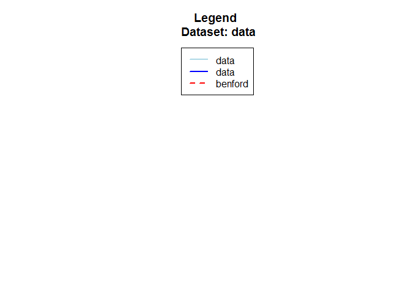<!-- -->
\>\>\>\>\>\>\> fa6684efee460f284f61fd9d1fd6f08b62855b82

\<\<\<\<\<\<\< HEAD 某些数据是不满足 Benfold 规则的， ||||||| merged common
ancestors \# Digit analysis ======= 1. 因此满足 benford 定律。 1.
`plot.Benford`存在bug。

## Satisfication

Many datasets satisfy Benford’s Law

1.  data where numbers represent sizes of facts or events
2.  data in which numbers have no relationship to each other
3.  data sets that grow exponentially or arise from multiplicative
    fluctuations
4.  mixtures of different data sets
5.  Some well-known infinite integer sequences
    1.  Fibonacci sequence
6.  Preferably, more than 1000 numbers that go across multiple orders.

Such as

1.  accounting transactions
2.  credit card transactions
3.  customer balances
4.  death rates
5.  diameter of planets
6.  electricity and telephone bills
7.  Fibonacci numbers
8.  incomes
9.  insurance claims
10. lengths and flow rates of rivers
11. loan data
12. numbers of newspaper articles
13. physical and mathematical constants
14. populations of cities
15. powers of 2
16. purchase orders
17. stock and house prices
    1.  可以做特征工程

这些可以不用记忆，等之后使用了再融会贯通。

某些数据是不满足 Benfold 规则的， \>\>\>\>\>\>\>
fa6684efee460f284f61fd9d1fd6f08b62855b82

1.  If there is lower and/or upper bound or data is concentrated in
    narrow interval, e.g. hourly wage rate, height of people.
2.  If numbers are used as identification numbers or labels, e.g. social
    security number, flight numbers, car license plate numbers, phone
    numbers.
3.  Additive fluctuations instead of multiplicative fluctuations,
    e.g. heartbeats on a given
day

## Benford’s Law for the first-two digits

\[P(D_1D_2 = d_1d_2) = \log(d_1d_2+1) - \log(d_1d_2) = \log(1 + \frac{1}{d_1d_2});d_1d_2 = 10,\dots,99\]

``` r
benford_data <- 
    tibble(
        d_1d_2 = 10:99
        ,P = log10(d_1d_2+1) - log10(d_1d_2)
    )
benford_data
#> # A tibble: 90 x 2
#>    d_1d_2      P
#>     <int>  <dbl>
#>  1     10 0.0414
#>  2     11 0.0378
#>  3     12 0.0348
#>  4     13 0.0322
#>  5     14 0.0300
#>  6     15 0.0280
#>  7     16 0.0263
#>  8     17 0.0248
#>  9     18 0.0235
#> 10     19 0.0223
#> # ... with 80 more rows
benford_data %>% 
    summarise(sum(P))
#> # A tibble: 1 x 1
#>   `sum(P)`
#>      <dbl>
#> 1        1
```

1.  也可以检验概率和为1

> This test is more reliable than the first digits test and is most
> frequently used in fraud detection. (Baesens, Höppner, and Verdonck
> 2018)

``` r
bfd.cen <- benford(census.2009$pop.2009,number.of.digits = 2) 
plot(bfd.cen)
```

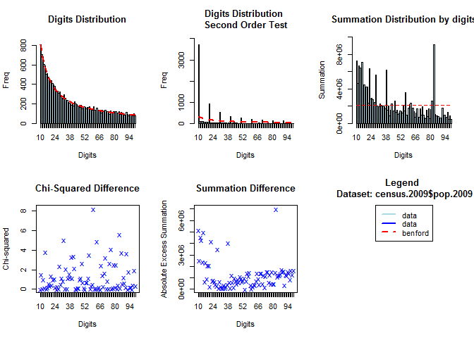<!-- -->

``` r
bfd1.exp <- benford(expenses,  number.of.digits = 1) 
plot(bfd1.exp)
```

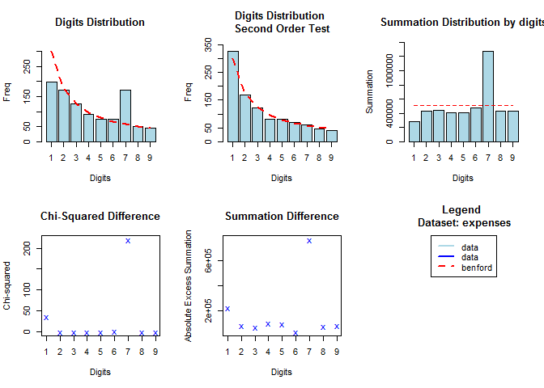<!-- -->

``` r
bfd2.exp <- benford(expenses, number.of.digits = 2) 
plot(bfd2.exp)
```

<!-- -->

## how to use

如上图一，字母在75左右时，数字没有符合 Benfold
规律，因此很有可能是人为因素，因此可以作为分类变量。

# Robust statistics for Outliers

## Robust z-scores

\[z_i = \frac{x_i - \hat \mu}{\hat \sigma} = \frac{x_i - \text{Med}(X)}{\text{Mad}(X)}\]

``` r
transfer <- 
    list.files('data',full.names = T) %>% 
    str_subset('transfer_chp4') %>% 
    map(~fread(.) %>% select(-id)) %>% 
    bind_cols()
```

``` r
# Get observations identified as fraud
which(transfers$fraud_flag == 1)
#> integer(0)

# Compute median and mean absolute deviation for `amount`
m <- median(transfers$amount)
s <- mad(transfers$amount)

# Compute robust z-score for each observation
robzscore <- abs((transfers$amount - m) / (s))

# Get observations with robust z-score higher than 3 in absolute value
which(abs(robzscore) > 3)
#>  [1]  1  5 10 12 16 38 39 41 43 47 48 51 55
```

<input type="checkbox" id="checkbox1" class="styled">
[`mad`理解清楚](https://en.wikipedia.org/wiki/Median_absolute_deviation)

1.  因此异常值的发现，相当于做一个分类变量。
2.  这里`amount`的异常值包含了四个欺诈用户的标签。
3.  这里的z score 没有对`amount`使用重复信息，它是根据`amount`的**分布**进行衍生的变量，算特征工程。

## Boxplot

\[[Q_1 - 1.5\text{IQR},Q_1 + 1.5\text{IQR}]\]

``` r
thexp <- fread(here::here('data','thexp.csv'),drop='id')
thexp <- thexp$thexp
```

``` r
# Create boxplot
bp.thexp <- boxplot(thexp, col = "lightblue", main = "Standard boxplot", ylab = "Total household expenditure")
```

<!-- -->

``` r

# Extract the outliers from the data
bp.thexp$out
#>  [1]  96396  95389  84354  85065  86577  92957 106032 107065  74958  78286
#> [11] 108756  74111  78760 116262  74197  74993  99834 147498  81646  94587
#> [21]  74298  75043  83158  79147 108752 130773  80495

# Create adjusted boxplot
library(robustbase)
adj.thexp <- adjbox(thexp, col = "lightblue", main = "Adjusted boxplot", ylab = "Total household expenditure")
```

<!-- -->

> However, when the data are skewed, usually many points exceed the
> whiskers and are often erroneously declared as outliers. An adjustment
> of the boxplot is presented that includes a robust measure of skewness
> in the determination of the whiskers. (Hubert and Vandervieren 2004)

因此 Adjusted boxplot(Hubert and Vandervieren 2004) 主要是针对 Skewed
数据而错判异常值而提出的。

<input type="checkbox" id="checkbox1" class="styled">Skewed
数据而错判异常值而提出的，找资源，可以就看这个paper
<input type="checkbox" id="checkbox1" class="styled">IQR怎么抉择

## Use mahalanobis distance for multivariate outliers

在这种情况下，异常值可以是多维度确定。

``` r
knitr::include_graphics(here::here('pic','mahalanobiseuclidean_ggplot.png'))
```

<!-- -->

> Mahalanobis (or generalized) distance for observation is the distance
> from this observation to the center, taking into account the
> covariance matrix. (Baesens, Höppner, and Verdonck 2018)

Mhalanobis distance 因为考虑了协方差，因此比 Euclidean distance 更有合理的假设。

> To detect multivariate outliers the mahalanobis distance is compared
> with a cut-off value, which is derived from the chisquare
> distribution. (Baesens, Höppner, and Verdonck 2018)

<input type="checkbox" id="checkbox1" class="styled">Mahalanobis
是如何从卡方从拿出来

<input type="checkbox" id="checkbox1" class="styled">根据tsi\_real 和 p
可以剔除一些异常值

``` r
hailinsurance <- 
    fread(here::here('data','hailinsurance.csv'),sep=' ') %>% 
    dplyr::select(-V1) %>% 
    as.matrix()
```

``` r
plot(hailinsurance)
```

<!-- -->

1.  如图，可以发现有异常值。

<!-- end list -->

``` r
# Compute the sample mean and sample covariance matrix
clcenter <- colMeans(hailinsurance)
clcov <- cov(hailinsurance)
```

``` r
clcenter
#>       [,1]       [,2] 
#> 197898.973   1549.658
clcov
#>           [,1]       [,2]
#> [,1] 854093524 12530366.4
#> [,2]  12530366   622840.6
```

``` r
# Add 97.5% tolerance ellipsoid
rad <- 
    sqrt(qchisq(0.975, ncol(hailinsurance))) %>% 
    sqrt
library(car)
plot(hailinsurance)
# call plot before 
ellipse(center = clcenter, shape = clcov, radius = rad, col = "blue", lty = 2)
```

<input type="checkbox" id="checkbox1" class="styled">为什么这里选择的是两列。

产生报错 `Error in plot.xy(xy.coords(x, y), type = type, ...) : plot.new has
not been called yet` 已经在
[https://community.rstudio.com/t/error-in-plot-xy-xy-coords-x-y-type-type-plot-new-has-not-been-called-yet/18750?u=econkid](Community)
上提问了。 解决方式是之前要先call `plot`。

> The function `qchisq` calculates a quantile from the chisquare
> distribution by giving as input parameters: 1) the probability
> (i.e. 97.5%) 2) the degrees of freedom.

### Animals data

  - `Animals`  
    containing the average brain and body weights for 28 species of land
    animals.

<!-- end list -->

``` r
library(MASS) 
data("Animals")
head(Animals)
#> # A tibble: 6 x 2
#>       body brain
#> *    <dbl> <dbl>
#> 1     1.35   8.1
#> 2   465    423  
#> 3    36.3  120. 
#> 4    27.7  115  
#> 5     1.04   5.5
#> 6 11700     50
Animals <- 
    Animals %>% 
    mutate_all(log)
head(Animals)
#> # A tibble: 6 x 2
#>     body brain
#> *  <dbl> <dbl>
#> 1 0.300   2.09
#> 2 6.14    6.05
#> 3 3.59    4.78
#> 4 3.32    4.74
#> 5 0.0392  1.70
#> 6 9.37    3.91
```

``` r
Animals %>% 
    gather(key,value,body:brain) %>% 
    ggplot(aes(x = key, y = value)) +
    stat_boxplot(width=0.2) + 
    ylab("log(weight)") + 
    xlab("")
```

<!-- -->

``` r
fig <- 
    Animals %>% 
    ggplot(aes(x = body, y = brain)) + 
    geom_point(size = 5) +
    ylim(-5, 15) + 
    scale_x_continuous(limits = c(-10, 16), breaks = seq(-15, 15, 5))
fig
```

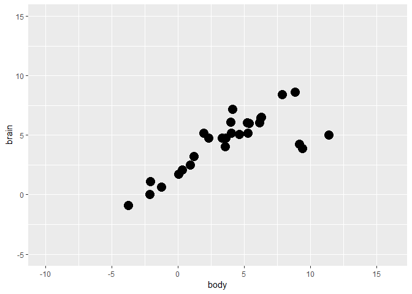<!-- -->

``` r
X <- Animals
animals.clcenter <- colMeans(X) 
animals.clcov <- cov(X)
rad <- sqrt(qchisq(0.975, df = ncol(X)))
library(car)
ellipse.cl <- 
    data.frame(
        ellipse(
            center = animals.clcenter
            ,shape = animals.clcov
            ,radius = rad
            ,segments = 100
            ,draw = FALSE)
        ) %>% 
    `colnames<-`(colnames(X))
fig <- 
    fig +
    geom_polygon(
        data=ellipse.cl
        ,color = "dodgerblue"
        ,fill = "dodgerblue"
        ,alpha = 0.2) + 
    geom_point(aes(x = animals.clcenter[1]
                   ,y = animals.clcenter[2])
               ,color = "blue"
               ,size = 6)
fig
```

<!-- -->

### Minimum Covariance Determinant (MCD)

<input type="checkbox" id="checkbox1" class="styled">MCD looks for those
h observations whose classical covariance matrix has the lowest possible
determinant.

``` r
library(robustbase) 
animals.mcd <- covMcd(X)
# Robust estimate of location
animals.mcd$center
#>     body    brain 
#> 3.028827 4.275608
# Robust estimate of scatter
animals.mcd$cov
#>           body    brain
#> body  18.85849 14.16031
#> brain 14.16031 11.03351
```

``` r
library(robustbase)
animals.mcd <- covMcd(X)
ellipse.mcd <- 
    data.frame(
        ellipse(
            center = animals.mcd$center
            ,shape = animals.mcd$cov
            ,radius=rad
            ,segments=100
            ,draw=FALSE)
        ) %>% 
    `colnames<-`(colnames(X))
fig <- 
    fig +
    geom_polygon(data=ellipse.mcd, color="red", fill="red", alpha=0.3) + 
    geom_point(aes(x = animals.mcd$center[1], y = animals.mcd$center[2]),color = "red", size = 6)
fig
```

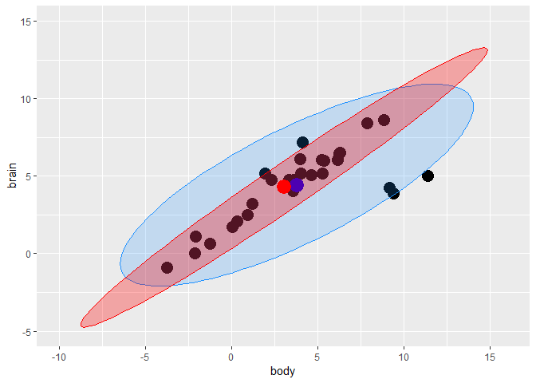<!-- -->

### Distance-distance plot

当变量为三个时，可以用3D图进行可视化，但是 当变量超过3个以上，就无法可视化 tolerance ellipsoid 了。

> The **distance-distance plot** shows the robust distance of each
> observation versus its classical Mahalanobis distance, obtained
> immediately from `MCD` object. (Baesens, Höppner, and Verdonck 2018)

<input type="checkbox" id="checkbox1" class="styled">distance-distance
plot 没有理解
<input type="checkbox" id="checkbox1" class="styled">如何导出outlier呢?

``` r
plot(animals.mcd, which = "dd")
```

<!-- -->

## other

robust statistcis vs. classic statistics

受到更少的outlier影响

z-score 有robust boxplot 有箱型图

书签
<https://campus.datacamp.com/courses/fraud-detection-in-r/digit-analysis-and-robust-statistics?ex=9>

# Reference

<div id="refs" class="references">

<div id="ref-BaesensFraud">

Baesens, Bart, Sebastiaan Höppner, and Tim Verdonck. 2018. “Fraud
Detection in R.” 2018.
<https://www.datacamp.com/courses/fraud-detection-in-r>.

</div>

<div id="ref-Chawla2002SMOTE">

Chawla, Nitesh V., Kevin W. Bowyer, Lawrence O. Hall, and W. Philip
Kegelmeyer. 2002. “SMOTE: Synthetic Minority over-Sampling Technique.”
*Journal of Artificial Intelligence Research* 16 (1): 321–57.

</div>

<div id="ref-Hubert2004An">

Hubert, M., and E. Vandervieren. 2004. “An Adjusted Boxplot for Skewed
Distributions.” *Computational Statistics & Data Analysis* 52 (12):
5186–5201.

</div>

<div id="ref-Nigrini2012Benford">

Nigrini, Mark, and Joseph T. Wells. 2012. “Benford’s Law: Applications
for Forensic Accounting, Auditing, and Fraud Detection.”

</div>

</div>
